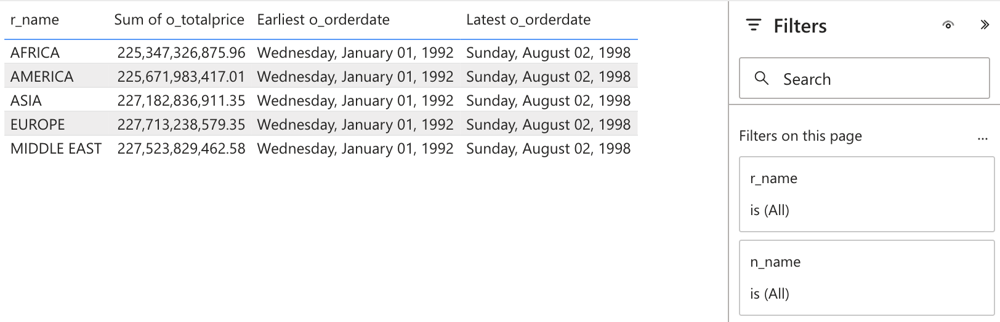
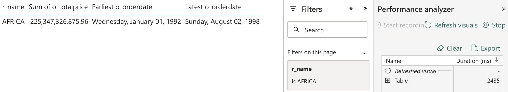
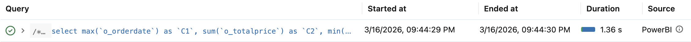
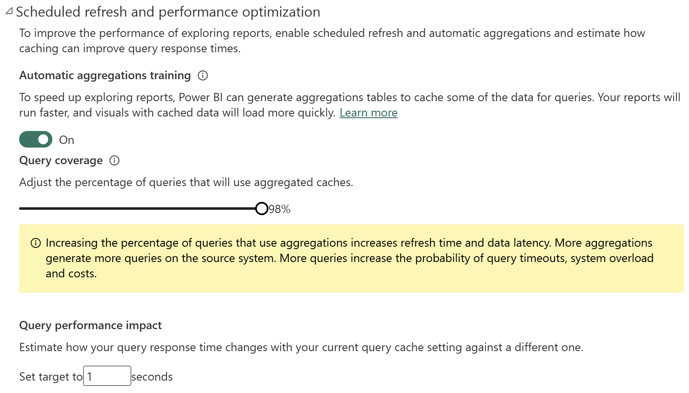
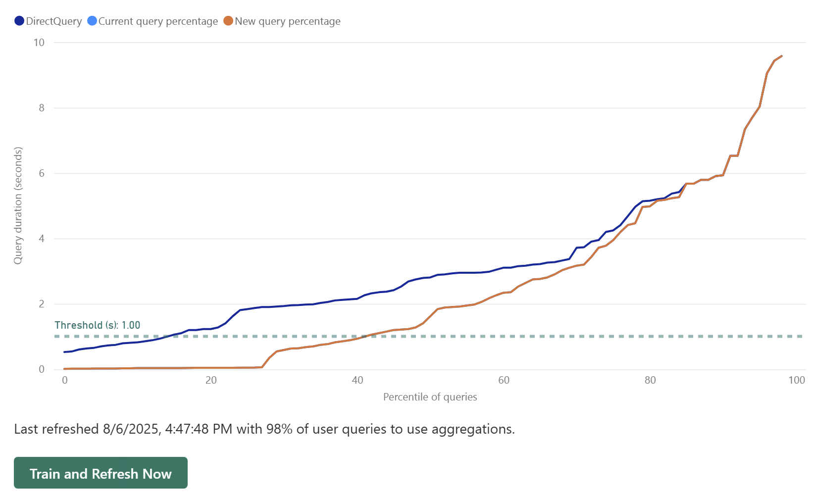
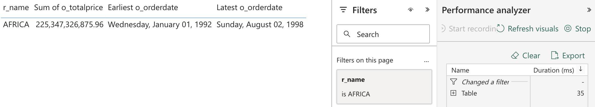
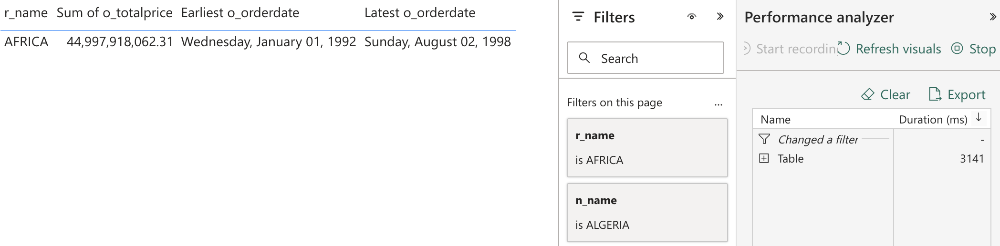

# Automatic Aggregations

## Introduction
As per Microsoft documentation:
> _[Automatic Aggregations](https://learn.microsoft.com/en-us/power-bi/enterprise/aggregations-auto) in Power BI use state-of-the-art machine learning (ML) to continuously optimize DirectQuery semantic models for maximum report query performance. Automatic aggregations are built on top of existing user-defined aggregations infrastructure first introduced with composite models for Power BI_.

In this quickstart, we showcase how to enable [Automatic Aggregations](https://learn.microsoft.com/en-us/power-bi/enterprise/aggregations-auto) in Power BI semantic model and train Automatic Aggregations in order to speed up exploring report. You can follow the steps mentioned in the [Step by step walkthrough](#step-by-step-walkthrough) section.


## Prerequisites

Before you begin, ensure you have the following:

- [Databricks account](https://databricks.com/), access to a Databricks workspace, Unity Catalog, and Databricks SQL Warehouse
- [Power BI Desktop](https://powerbi.microsoft.com/desktop/), latest version is highly recommended
- [Power BI](https://powerbi.com) **Premium** workspace
- Optionally - [DAX Studio](https://daxstudio.org/)


## Step by step walkthrough

1. Create a catalog and a schema in Databricks Unity Catalog.
    ```sql
    CREATE CATALOG IF NOT EXISTS powerbiquickstarts;
    USE CATALOG powerbiquickstarts;
    CREATE SCHEMA IF NOT EXISTS tpch;
    USE SCHEMA tpch;
    ```

2. Create test tables in the catalog by replicating tables from **`samples`** catalog.
    ```sql
   CREATE OR REPLACE TABLE nation AS SELECT * FROM samples.tpch.region;
   CREATE OR REPLACE TABLE nation AS SELECT * FROM samples.tpch.nation;
   CREATE OR REPLACE TABLE customer AS SELECT * FROM samples.tpch.customer;
   CREATE OR REPLACE TABLE orders AS SELECT * FROM samples.tpch.orders;

   CREATE OR REPLACE VIEW v_nation AS 
   SELECT *, now() as currenttime FROM nation;
    ```

3. Open Power BI Desktop → **"Home"** → **"Get Data"** → **"More..."**.

4. Search for **Databricks** and select **Azure Databricks** (or **Databricks** when using Databricks on AWS or GCP).

5. Enter the following values:
   - **Server Hostname**: Enter the Server hostname value from Databricks SQL Warehouse connection details tab.
   - **HTTP Path**: Enter the HTTP path value  from Databricks SQL Warehouse connection details tab.

> [!TIP]
> We recommend parameterizing your connections. This really helps ease out the Power BI development and administration expeience as you can easily switch between different environments, i.e., Databricks Workspaces and SQL Warehouses. For details on how to paramterize your connection string, you can refer to [Connection Parameters](/01.%20Connection%20Parameters/) article.

6. Connect to **`powerbiquickstarts`** catalog, **`tpch`** schema.

7. Add tables as follows.Below is the data model for the sample report.
   - **`region`** - dimension table, **Dual** storage mode
   - **`v_nation`** - dimension table, **Dual** storage mode, use **`nation`** alias
   - **`customer`** - dimension table, **DirectQuery** storage mode
   - **`orders`** - fact table, **DirectQuery** storage mode

> [!IMPORTANT]
> Here we use `v_nation` view, not `nation` table. The view uses `now()` function that prevents QRC (Query Result Caching). Therefore, for every query execution we will have non-cached query profile with execution metrics available for analysis.

8. If relationships are not created automatically, create table relationships as follows.
   - **`region`** → **`nation`** → **`customer`** → **`orders`** → **`lineitem`** 

9. The semantic model should look as on the screenshot below.

    

10. Create a simple tabular report displaying **`r_name`**, **`n_name`**, Count of **`l_orderkey`**, Earliest **`l_shipdate`**, Sum of **`l_discount`**, and Sum of **`l_quantity`**. Add **`r_name`** and **`n_name`** columns to page filters.

    

11. Publish the report to Power BI Service, **Premium** workspace.

12. Open the report in a web browser. Filter by **r_name** = **AFRICA**.

13. Open Performance Analyzer - **Edit** → **View** → **Performance Analyzer** → **Start recording**.

14. Click **Refresh visuals**. As shown below, in our environment it took **2435ms** to refresh the visuals.

    

    The screenshot below shows the query hit the Databricks SQL Warehouse. 

    

15. Now open the settings of the published semantic model in the **Premium** Power BI workspace.

16. Enable the Automatic Aggregations in the semantic model settings. You can set the **Query coverage** according to your needs. This setting will increase the number of user queries analyzed and considered for performance improvement. The higher percentage of Query coverage will lead to more queries being analyzed, hence higher potential benefits, however aggregations training will take longer. 

    

    Click **Apply** to enable the automatic aggregations.

17. Power BI uses an internal query log to train aggregations. Thus, we need to populate the query log. We can achieve this by opening the report and interacting with the report by selecting different **`r_name`** in the Filters pane. Alternatively, you can run a sample [DAX-query](./Query.dax) using [DAX Studio](https://daxstudio.org/). Please make sure to run it multiple times using different values for **`r_name`**.

    ```
    // DAX Query
    DEFINE
        VAR __DS0FilterTable = 
            TREATAS({"AFRICA"}, 'region'[r_name])

        VAR __DS0Core = 
            SUMMARIZECOLUMNS(
                'nation'[n_name],
                'region'[r_name],
                __DS0FilterTable,
                "Suml_discount", CALCULATE(SUM('lineitem'[l_discount])),
                "Suml_quantity", CALCULATE(SUM('lineitem'[l_quantity])),
                "Minl_shipdate", CALCULATE(MIN('lineitem'[l_shipdate])),
                "Countl_orderkey", CALCULATE(COUNTA('lineitem'[l_orderkey]))
            )

        VAR __DS0PrimaryWindowed = 
            TOPN(501, __DS0Core, 'region'[r_name], 1)

    EVALUATE
        __DS0PrimaryWindowed

    ORDER BY
        'region'[r_name]
    ```
> [!NOTE]
> Please note that for better aggregations training you need to run the multiple times by using different filter values for `r_name` and `n_nation` columns.
 
18. Open Power BI workspace settings → Scheduled refresh and performance optimization. You should be able to see the estimated benefits of the automatic aggregations.
    
    


> [!WARNING]
> If you see a warning message as shown on the screenshot below, it means that Power BI query log is still empty and automatic aggregations can't be created. In this case, you need to interact more with your report to get the query log populated.


19. Click Train and Refresh Now to start the aggregations training manually. You can also configure scheduled refresh here.
   
20. Once the model is trained, Power BI will have aggregated values in in-memory cache. Next time you interact with the report using similar patterns (dimensions, measures, filters) Power BI will leverage cached aggregations to serve the queries and will not send queries to Databricks SQL Warehouse. Hence, you may expect sub-second report refresh performance.

21. Open the report in the browser. Open Performance Analyzer - **Edit** → **View** → **Performance Analyzer** → **Start recording**.

22. Set the same filter values as previously - **r_name** = **AFRICA**. Click **Refresh visuals**. You should see that the table refresh is now much faster. As shown below, in our environment it took **35ms** to refresh the visuals. That is much faster than **2435ms** that we observed initially. This is due to Power BI hitting automatic aggregations at `{r_name}` granularity.

    

23. In Databricks Query History, you should also see that there are no new SQL-queries fired by Power BI to render the report page.

24. Now, add set another page filter in the report - **n_name** = **ALGERIA**. You should see that the table refresh is slower. In our test it took **3141ms**. This is because Power BI does not have aggregations at `{r_name, n_name}` granularity, therefore Power BI has to retrieve data via DirectQuery.

    


## Conclusion

Power BI [Automatic Aggregations](https://learn.microsoft.com/en-us/power-bi/enterprise/aggregations-auto) leverage advanced machine learning to optimize *DirectQuery* semantic models and dramatically improve report performance. By analyzing user query patterns, Power BI automatically creates and manages in-memory aggregation tables, allowing frequently requested data to be served rapidly from cache instead of querying the backend data source each time. This results in much faster report visuals, reduced load on the source systems, and increased scalability - especially beneficial for large and complex datasets.

Unlike [User-defined aggregations](https://learn.microsoft.com/en-us/power-bi/transform-model/aggregations-advanced), automatic aggregations don't require extensive data modeling and query-optimization skills to configure and maintain.
Automatic aggregations require minimal setup, self-optimize over time, and remove the need for extensive manual modeling, making high-performance analytics accessible to users of all skill levels.


## Power BI Template 

A Power BI template [Automatic Aggregations.pbit](./Automatic%20Aggregations.pbit) and [Automatic Aggregations.sql](./Automatic%20Aggregations.sql) script are provided in this folder to demonstrate the difference in Power BI behaviour when using *Import*, *DirectQuery*, and *Dual* storage modes outlined above. To use the template, simply enter your Databricks SQL Warehouse's **`ServerHostname`** and **`HttpPath`** that correspond to the environment set up in the instructions above. The template uses **`samples`** catalog, therefore you don't need to prepare any additional dataset.