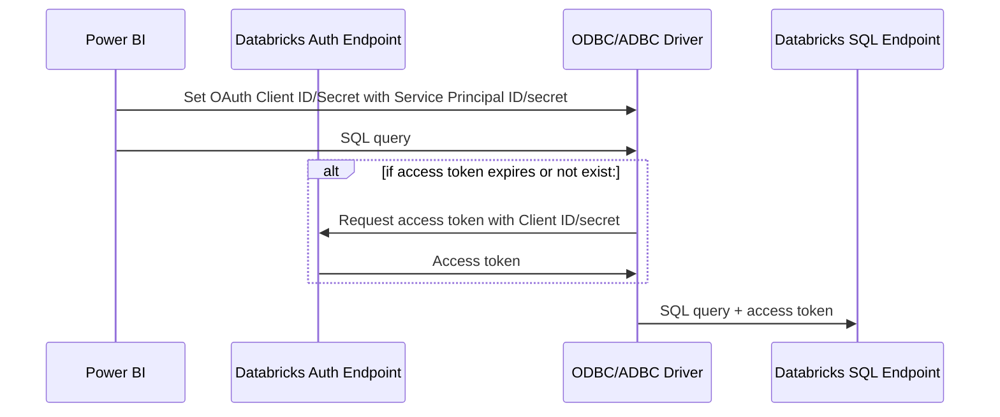
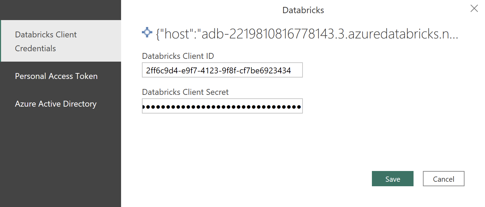
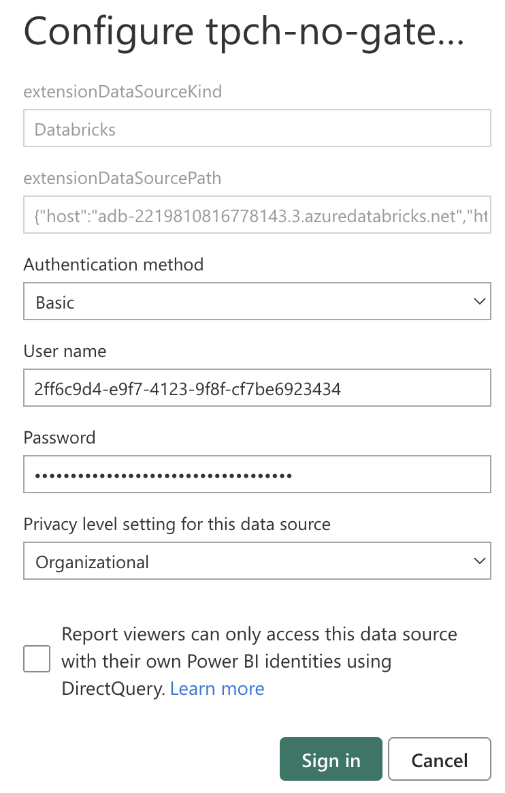
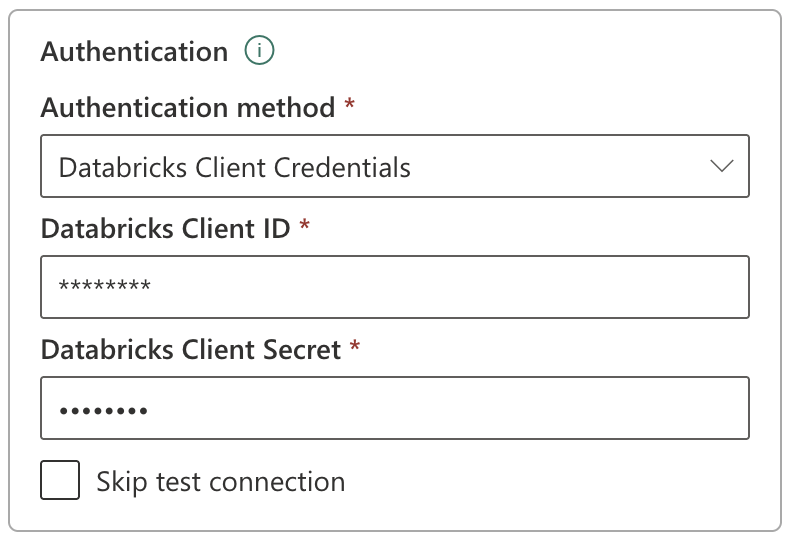
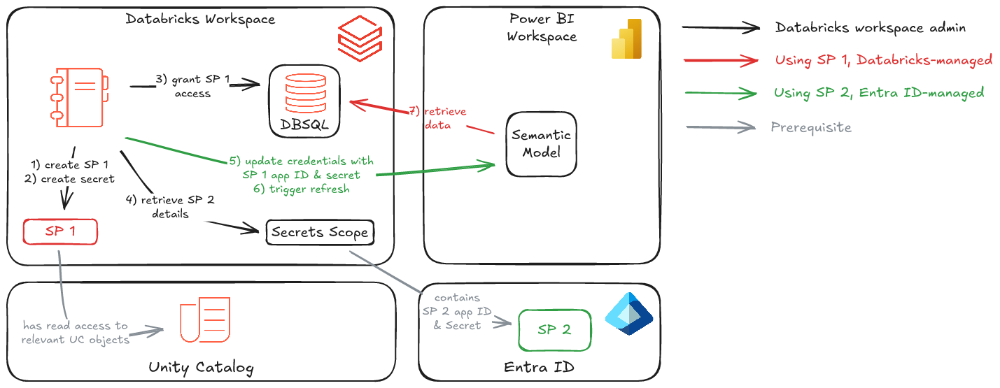
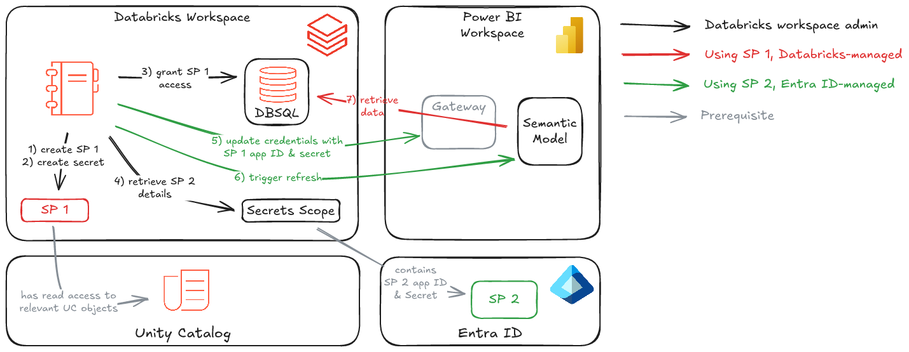

# M2M OAuth Credentials Management 

## Introduction

When connecting **Power BI** to **Databricks**, many developers and administrators who **do not require SSO** encounter challenges with ensuring secure and reliable authentication.

### Traditional Authentication Methods

Historically, two approaches were commonly used:
1. **Personal Access Tokens (PATs)**
    - Widely rejected across organizations due to security concerns.
    - Often prohibited by enterprise security policies.
2. Microsoft Entra ID (User-Based Authentication)
    - Relies on individual user credentials.
    - Introduces operational risks:
        - Credentials may expire unexpectedly.
        - The responsible user might be unavailable when credentials need updating.
    - In these situations, Power BI administrators are forced to:
        - Take ownership of the dataset.
        - Re-enter different credentials.
        - Risk **downtime and disruption** for Power BI users.

### The Problem with User-Based Authentication

Using Microsoft Entra ID with personal credentials inherently creates dependencies:
- **Expired credentials** → causes failed connections.
- **Unavailable users** → delays in restoring access.
- **Admin intervention** required → additional operations burden.

This creates ongoing operational overhead for administrators and potential interruptions for report consumers.

### A More Secure Alternative: Service Principals with M2M OAuth
The introduction of [Databricks Managed Service Principals](https://learn.microsoft.com/en-us/azure/databricks/admin/users-groups/service-principals#databricks-and-microsoft-entra-id-service-principals) enables a more secure and robust solution: **Machine-to-Machine (M2M) OAuth authentication**.

Benefits of M2M OAuth authentication:
- 🔒 **Improved Security** – Eliminates the need for PATs.

- 🔄 **No Expired Credentials** – Service principal secrets can be renewed and updated in Power BI using automation.

- ⚙️ **Centralized Management** – Access can be granted and revoked centrally through Databricks platform.

- 📈 **Higher Reliability** – eliminates dependency on individual users, minimizing downtime risks.

    

## Set up M2M OAuth in Power BI
M2M OAuth addresses security concerns that come with credential rotations when using personal access tokens. Power BI Desktop 2.143.878.0 (May 2025 release) or above is required for this authentication method.

To set up and configure a service principal for M2M OAuth, do the following:

1. Create a service principal and assign it to a workspace. See [Add service principals to your account](https://learn.microsoft.com/en-us/azure/databricks/admin/users-groups/manage-service-principals#-add-service-principals-to-your-account).
    - If you choose Microsoft Entra ID managed as your Management option during setup, paste the application or client ID for the service principal.
2. Set up a client secret in Databricks to generate access tokens. See [Step 1: Create an OAuth secret](https://learn.microsoft.com/en-us/azure/databricks/dev-tools/auth/oauth-m2m#-step-1-create-an-oauth-secret).
    - For service principals synced from Entra, the client secret must be set in Databricks. This secret is not the same secrete created in Entra ID.
3. Grant the service principal SELECT permissions on the data assets used in Power BI. See [Grant permissions on objects in a Unity Catalog metastore](https://learn.microsoft.com/en-us/azure/databricks/data-governance/unity-catalog/manage-privileges/#-grant-permissions-on-objects-in-a-unity-catalog-metastore).
4. Grant the service principal [CAN USE](https://docs.databricks.com/aws/en/security/auth/access-control/#sql-warehouse-acls) permissions on the SQL warehouse used to connect to Power BI. See [Manage a SQL warehouse](https://learn.microsoft.com/en-us/azure/databricks/compute/sql-warehouse/create#manage).
5. In **Power BI Desktop**, use **Databricks Client Credentials** authentication method and enter service principal Client ID and Client Secret as shown below.

  

> [!IMPORTANT]
> Power BI Desktop 2.143.878.0 (May 2025 release) or above is required for this authentication method.

6. In Power BI Service for datasets that don't use gateways, use **Basic** authentication method and enter service principal Client ID and Client Secret as shown below.

  

7. In Power BI Service for datasets that use gateways, use  **Databricks Client Credentials** authentication method and enter service principal Client ID and Client Secret as shown below.

  

## Secrets Rotation

While using **Databricks Managed Service Principals** with Power BI greatly enhances security, there remains an important requirement: **robust secrets rotation**.

This quickstart provides **reference implementations** for automating the rotation of secrets associated with Databricks Service Principals, ensuring secure and uninterrupted connectivity between **Power BI** and **Databricks**.

1. Create Databricks managed Service Principal (SP1) if it does not exist.
2. Create OAuth secret for the Service Principal (SP1).
3. Grant Service Principal (SP1) CAN USE permission on target SQL Warehouse.
> [!IMPORTANT]
> This must be the SQL Warehouse used by Power BI dataset as a data source.

4. Retrieve Entra ID Service Principal (SP2) details from Databricks secrets. 
> [!IMPORTANT]
> **SP2** is not the same Service Principal as **SP1** mentioned in step #1. The Service Principal **SP2** is used for connecting to Power BI Service and performing manipulations with data source credentials.
5. Update Power BI dataset credentials with Databricks Service Principal (SP1) application Id and secret.
6. Optionally trigger Power BI dataset refresh.
7. Power BI dataset retrieves data from Databricks SQL Warehouse.

When Power BI dataset is configured to use a gateway - such as On-premises Data Gateway or VNET managed gateway - credentials must be updated in the corresponding data source within Power BI that is associated with the gateway.

## Reference Implementation

This quickstart offers 3 reference implementations for updating M2M OAuth credentials:
- **Databricks notebook** - [code](./notebook/Update-M2M-OAuth-Credentials.py), [readme](./notebook/)
- **Bash script** - [code](./bash/Update-M2M-OAuth-Credentials.sh), [readme](./bash/)
- **PowerShell script** - [code](./powershell/), [readme](./powershell/)

## Additional Considerations

The primary goal of this quickstart is to demonstrate how to **programmatically refresh M2M OAuth credentials** for Power BI when connecting to Databricks.
Every customer environment is unique, so the sample code provided here should be treated as a **reference template** and adapted to your specific requirements.

For teams managing access to Databricks exclusively via **On-Premises Data Gateways** or **VNET-managed gateways** (such as environments using private front-end links), we recommend following a three-step process:
1. **Provision Credentials**
    - Create a Service Principal (if it doesn’t already exist).
    - Generate a client secret.
    - Store the credentials securely as Databricks secrets for later retrieval.

2. **Identify distinct Gateways and Data Sources**
    - Discover **GatewayId** and **DataSourceId** combinations using one of two approaches:
        - Based on the Databricks SQL Warehouse ID, i.e., all connections routed through a specific SQL warehouse.
        - Based on the Databricks hostname used in the connection string.

> [!NOTE]
> It is assumed that only one data source connection exists per Databricks workspace and SQL Warehouse. If multiple data sources are configured for different Service Principals, maintain a mapping list of: Gateway Data Source Name, Databricks Workspace, SQL Warehouse, Service Principal.

3. **Apply Credential Updates**
    - Refresh credentials only for the distinct combinations of gateways and data sources identified above.

## Conclusion

Using **Databricks Managed Service Principals** with **Machine-to-Machine (M2M) OAuth authentication** in Power BI provides a secure, scalable, and reliable alternative to personal access tokens and user-based credentials when SSO is not required. This approach eliminates security risks associated with PATs, removes dependencies on individual users, and reduces downtime caused by expired credentials. With centralized access management, automated secret rotation, and seamless integration into Databricks and Power BI, M2M OAuth enables organizations to maintain **strong security**, **higher reliability**, and **simplified credential governance** for analytics workloads.
