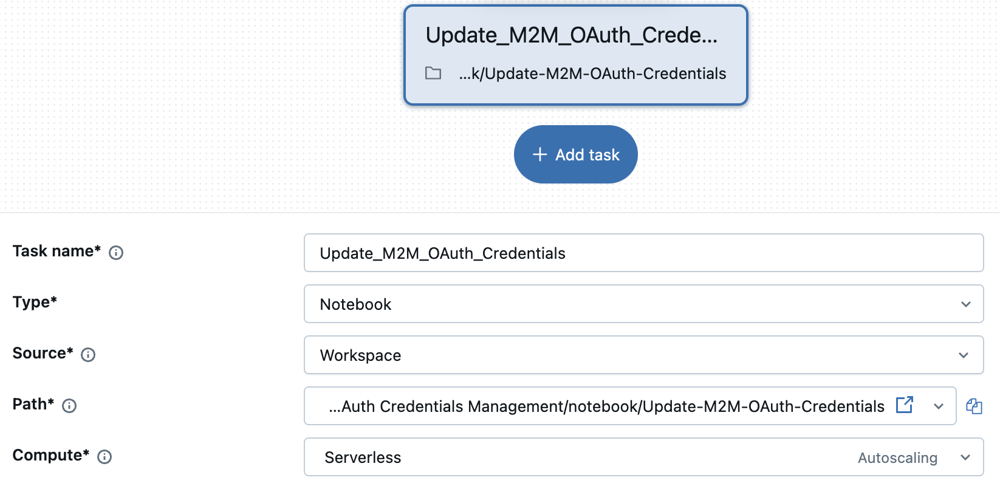
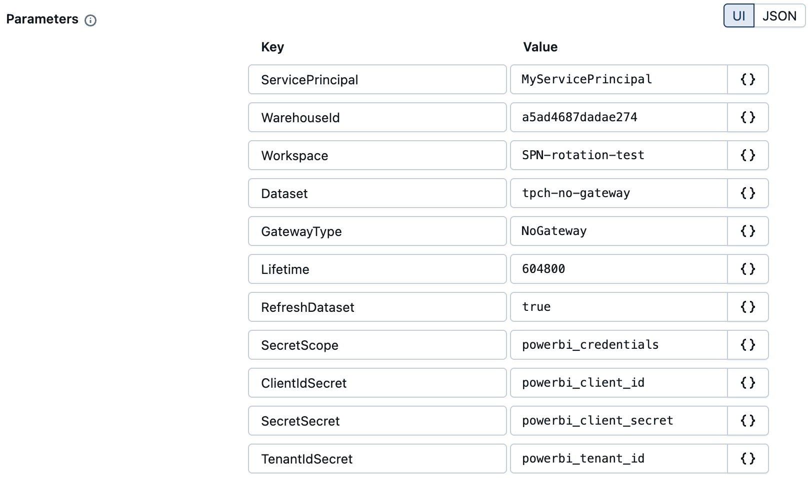

# M2M OAuth Credentials Management - Databricks notebook


## Prerequisites

Before you begin, ensure you have the following:

- [Databricks account](https://databricks.com/), access to a Databricks workspace, and Databricks SQL Warehouse
    - [Permissions](https://docs.databricks.com/aws/en/admin/users-groups/service-principals#who-can-manage-and-use-service-principals) to create and manage service principals, either **Account admins** or **Workspace admins**. 
- [Databricks compute](https://docs.databricks.com/aws/en/compute/) cluster
  - [All-purpose compute](https://docs.databricks.com/aws/en/compute/use-compute) cluster for interactive notebook execution
  - [Jobs compute](https://docs.databricks.com/aws/en/jobs/compute) cluster for scheduled notebook execution via [Lakeflow jobs](https://docs.databricks.com/aws/en/jobs/)
  - Both [Classic](https://docs.databricks.com/aws/en/jobs/run-classic-jobs) and [Serverless](https://docs.databricks.com/aws/en/jobs/run-serverless-jobs) computes are supported
- [Microsoft Entra ID Service Principal](https://learn.microsoft.com/en-us/entra/identity-platform/app-objects-and-service-principals) which has permissions to access target Power BI workspace, dataset, gateway
    - `ClientID`, `Secret`, and `TenantID` must be stored as [Databricks secrets](https://docs.databricks.com/aws/en/security/secrets/)
    - Entra ID Service Principal must have permisions to change settings of the dataset and the gateway (if gateway is in use)

> [!NOTE]
> This code utilizes the [Power BI REST API](https://learn.microsoft.com/en-us/rest/api/power-bi/) as described in the official Power BI REST API documentation and does not require installation of additional packages or libraries.


## Notebook parameters

| **Parameter**           | **Purpose**                                                                                   |
| ----------------------- | --------------------------------------------------------------------------------------------- |
| `ServicePrincipal`	    | The name of the Service Principal to be created or updated                                    |
| `WarehouseId`           | The SQL Warehouse ID to be used by the Service Principal                                      |
| `Workspace`             | The name of the Power BI Workspace                                                            |
| `Dataset`               | The name of the Power BI dataset (semantic model)                                             |
| `GatewayType`           | The type of gateway used by Power BI semantic mode - `NoGateway`, `Onpremises`, `VNET`        |
| `Lifetime`              | The lifetime of the secret in seconds                                                         |
| `RefreshDataset`        | The flag indicating if the dataset shall be refreshed                                         |
| `SecretScope`           | The name of the Databricks secret scope where Entra ID Service Principal details are stored   |
| `ClientIdSecret`        | The name of the Databricks secret scope where Entra ID Service Principal Client ID is stored  |
| `SecretSecret`          | The name of the Databricks secret scope where Entra ID Service Principal Secret is stored     |
| `TenantIdSecret`        | The name of the Databricks secret scope where Entra ID Service Principal Tenant ID is stored  |


## Notebook walkthrough

### Notebook environment tasks

#### 1. Install the required libraries

```python
%pip install azure-identity
%pip install --upgrade databricks-sdk
%restart_python
```

#### 2. Setup the notebook to use parameters (set default values as required)

```python
dbutils.widgets.text("ServicePrincipal", "")
dbutils.widgets.text("WarehouseId", "")
dbutils.widgets.text("Workspace", "")
dbutils.widgets.text("Dataset", "")
dbutils.widgets.dropdown("GatewayType", "NoGateway", ["NoGateway", "Onpremises", "VNET"])
dbutils.widgets.text("Lifetime", "604800")
dbutils.widgets.dropdown("RefreshDataset", "true", ["true", "false"])
dbutils.widgets.text("SecretScope", "")
dbutils.widgets.text("ClientIdSecret", "")
dbutils.widgets.text("SecretSecret", "")
dbutils.widgets.text("TenantIdSecret", "")
```

#### 3. Get the parameters into python variables, to be used in the cells below

```python
ServicePrincipal = dbutils.widgets.get("ServicePrincipal")
WarehouseId = dbutils.widgets.get("WarehouseId")
Workspace = dbutils.widgets.get("Workspace")
Dataset = dbutils.widgets.get("Dataset")
GatewayType = dbutils.widgets.get("GatewayType")
Lifetime = dbutils.widgets.get("Lifetime")
RefreshDataset = dbutils.widgets.get("RefreshDataset")
SecretScope = dbutils.widgets.get("SecretScope")
ClientIdSecret = dbutils.widgets.get("ClientIdSecret")
SecretSecret = dbutils.widgets.get("SecretSecret")
TenantIdSecret = dbutils.widgets.get("TenantIdSecret")
```


### Databricks Service Principal related tasks

#### 4. Check if service principal exists, if not create one

```python
from services.databricks_service import DatabricksService
dbx_svc = DatabricksService()
dbx_svc.CreateClient()
```

```python
ServicePrincipalApplicationId, ServicePrincipaId = dbx_svc.CheckServicePrincipal(ServicePrincipal)
```


##### 5. Check if the service principal has the maximum allowed secrets

```python
dbx_svc.CheckServicePrincipalSecret(ServicePrincipaId)
```


##### 6. Create a new secret for the Service Principal

```python
ServicePrincipalSecret = dbx_svc.GenerateServicePrincipalSecret(ServicePrincipaId,Lifetime)
```


##### 7. Grant Service Principal CAN USE permission on the SQL Warehouse

```python
dbx_svc.GrantPermissionsOnWarehouse(ServicePrincipalApplicationId, WarehouseId)
```


### Power BI related tasks

##### 8. Retrieve Entra ID Service Principal credentials from Databricks secrets

```python
PowerBIClientId = dbutils.secrets.get(SecretScope, ClientIdSecret)
PowerBIClientSecret = dbutils.secrets.get(SecretScope, SecretSecret)
PowerBITenantId = dbutils.secrets.get(SecretScope, TenantIdSecret)
```


#### 9. Acquire Power BI access token

```python
from services.powerbi_service import PowerbiService

pbi_svc = PowerbiService()
pbi_svc.CreateCredential(
    tenant_id=PowerBITenantId,
    client_id=PowerBIClientId,
    client_secret=PowerBIClientSecret,
)
```


#### 10. Get the Workspace Id by the Workspace name

```python
WorkspaceId = pbi_svc.GetWorkspaceId(Workspace)
```

#### 11. Get the Dataset id by the Dataset name

```python
DatasetId=pbi_svc.GetDatasetId(WorkspaceId,Dataset)
```

#### 12. Take over the Power BI dataset ownership (if no gateway)

> [!IMPORTANT]
> Please note that there is no need to take over the dataset ownership if a gateway (Vnet or On-premise gateway) is in use.

```python
if GatewayType == "NoGateway":
    pbi_svc.TakOverDataset(WorkspaceId, DatasetId)
```


#### 13. Fetch Databricks datasource from the Power BI dataset

```python
GatewayId, DataSourceId = pbi_svc.GetDatasetDatasource(WorkspaceId, DatasetId)
```


#### 14. Construct a new Power BI credentials payload

> [!IMPORTANT]
> Please note that there is no need to encrypt credentials if no gateway or VNET gateway is in use, otherwise (On-premises gateway) credentials must be encrypted.


- Construct **encrypted** credentials payload
```python
from services.encrypt_credentials_service import EncryptCredentialsService

if GatewayType == "Onpremises":
    public_key = pbi_svc.GetGatewayPublicKey(GatewayId)
    enc = EncryptCredentialsService(public_key)
    EncryptionAlgorithm = "RSA-OAEP"
    Credentials = enc.EncodeCredentials(
        "{'credentialData':[{'name':'username','value':'"
        + ServicePrincipalApplicationId
        + "'},{'name':'password','value':'"
        + ServicePrincipalSecret
        + "'}]}"
    )
```

- Construct **non-encrypted** credentials payload
```python 
else:
    EncryptionAlgorithm = "None"
    Credentials = f'{{"credentialData":[{{"name":"username", "value": "{ServicePrincipalApplicationId}"}},{{"name":"password", "value": "{ServicePrincipalSecret}"}}]}}'
```


#### 15. Update Power BI datasource credentials

```python
pbi_svc.UpdateDatasetDatasource(GatewayId, DataSourceId, Credentials, EncryptionAlgorithm)
```

> [!IMPORTANT]
> Please note that it is assumed that the SQL Warehouse used by the Power BI dataset/datasource is the same as specified in the parameters of the notebook.If these are different SQL Warehouses, the notebook may fail while updating credentials.


#### 16. Optionally - trigger dataset refresh

```python
if RefreshDataset == "true":
    pbi_svc.RefreshDataset(WorkspaceId, DatasetId)
```


## Lakeflow Job configuration

The notebook can be used in a [Lakeflow job](https://docs.databricks.com/aws/en/jobs/) for automated execution.
Sample task configuration and parameters are shown below.



Alternatively, you can define parameters using JSON as shown below.
```json
{
  "ServicePrincipal": "MyServicePrincipal",
  "WarehouseId": "d07f8713ff62fff5",
  "Workspace": "SPN-rotation-test",
  "Dataset": "tpch-no-gateway",
  "GatewayType": "NoGateway",
  "Lifetime": "604800",
  "RefreshDataset": "true",
  "SecretScope": "powerbi_credentials",
  "ClientIdSecret": "powerbi_client_id",
  "SecretSecret": "powerbi_client_secret",
  "TenantIdSecret": "powerbi_tenant_id"
}
```