# Data Source Default Max Connections

## Introduction

Power BI reports built with DirectQuery or Composite models often trigger multiple SQL queries to Databricks. While the Databricks SQL engine provides excellent single-query performance and scales efficiently for high concurrency, overall user experience can degrade when Power BI does not parallelize SQL queries enough.

This quickstart guide shows how to optimize query parallelization in Power BI to fully leverage the scale-out capabilities of Databricks SQL Warehouses by using [Data Source Default Max Connections](https://learn.microsoft.com/en-us/dotnet/api/microsoft.analysisservices.tabular.model.datasourcedefaultmaxconnections) setting.


## Prerequisites

Before you begin, ensure you have the following:

- [Databricks account](https://databricks.com/), access to a Databricks workspace, Unity Catalog, and SQL Warehouse
- [Databricks SQL Warehouse](https://docs.databricks.com/gcp/en/compute/sql-warehouse/), **Serverless**, scaling **Min. 1**, **Max. 5** clusters.
- [Power BI Desktop](https://powerbi.microsoft.com/desktop/), latest version is highly recommended
- [Power BI](https://powerbi.com) workspace assigned to **Premium** capacity - **P1**, **A4**, **F64**, or higher


  
## Step by step walkthrough

### Preparation

1. Create a catalog and a schema in Databricks Unity Catalog.
    ```sql
    CREATE CATALOG IF NOT EXISTS powerbiquickstarts;
    USE CATALOG powerbiquickstarts;
    CREATE SCHEMA IF NOT EXISTS tpch;
    USE SCHEMA tpch;
    ```

2. Create tables in the catalog by replicating tables from **`samples`** catalog.
    ```sql
    CREATE OR REPLACE TABLE region AS SELECT * FROM samples.tpch.region;
    CREATE OR REPLACE TABLE nation AS SELECT * FROM samples.tpch.nation;
    CREATE OR REPLACE TABLE customer AS SELECT * FROM samples.tpch.customer;
    CREATE OR REPLACE TABLE part AS SELECT * FROM samples.tpch.part;
    CREATE OR REPLACE TABLE orders AS SELECT * FROM samples.tpch.orders;
    CREATE OR REPLACE TABLE lineitem AS SELECT * FROM samples.tpch.lineitem;
    ```

3. Open Power BI Desktop → **"Home"** → **"Get Data"** → **"More..."**.

4. Search for **Databricks** and select **Azure Databricks** (or **Databricks** when using Databricks on AWS or GCP).

5. Enter the following values:
   - **Server Hostname**: Enter the Server hostname value from Databricks SQL Warehouse connection details tab.
   - **HTTP Path**: Enter the HTTP path value  from Databricks SQL Warehouse connection details tab.

> [!TIP]
> We recommend parameterizing your connections. This really helps ease out the Power BI development and administration expeience as you can easily switch between different environments, i.e., Databricks Workspaces and SQL Warehouses. For details on how to paramterize your connection string, you can refer to [Connection Parameters](/01.%20Connection%20Parameters/) article.

6. Connect to Databricks SQL Warehouse, **`powerbiquickstarts`** catalog, **`tpch`** schema, and add the following tables to the semantic model. All tables should be set to **DirectQuery** storage mode.
    - `region`
    - `nation`
    - `part`
    - `customer`
    - `orders`
    - `lineitem`
    
7. Create table relationships as shown on the picture below.
    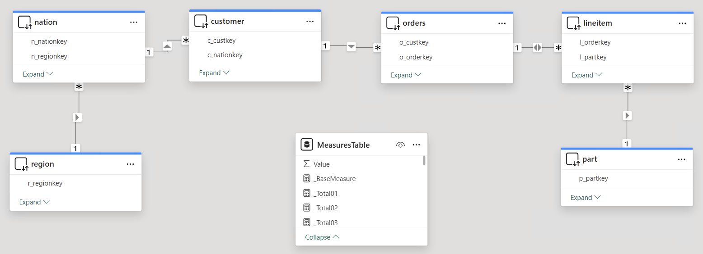

8. Create a new table that will contain calculated measures.
    ```
    MeasuresTable = {BLANK()}
    ```

9. Create calculated measures in the **`MeasuresTable`**
    ```
    _SumTotalPrice = SUM(orders[o_totalprice])
    _TotalPrice01 = CALCULATE([_SumTotalPrice], part[p_container]="JUMBO BAG")
    _TotalPrice02 = CALCULATE([_SumTotalPrice], part[p_container]="JUMBO BOX")
    _TotalPrice03 = CALCULATE([_SumTotalPrice], part[p_container]="JUMBO CAN")
    _TotalPrice04 = CALCULATE([_SumTotalPrice], part[p_container]="JUMBO CASE")
    _TotalPrice05 = CALCULATE([_SumTotalPrice], part[p_container]="JUMBO DRUM")
    _TotalPrice06 = CALCULATE([_SumTotalPrice], part[p_container]="JUMBO JAR")
    _TotalPrice07 = CALCULATE([_SumTotalPrice], part[p_container]="JUMBO PACK")
    _TotalPrice08 = CALCULATE([_SumTotalPrice], part[p_container]="JUMBO PKG")
    _TotalPrice09 = CALCULATE([_SumTotalPrice], part[p_container]="LG BAG")
    _TotalPrice10 = CALCULATE([_SumTotalPrice], part[p_container]="LG BOX")
    _TotalPrice11 = CALCULATE([_SumTotalPrice], part[p_container]="LG CAN")
    _TotalPrice12 = CALCULATE([_SumTotalPrice], part[p_container]="LG CASE")
    _TotalPrice13 = CALCULATE([_SumTotalPrice], part[p_container]="LG DRUM")
    _TotalPrice14 = CALCULATE([_SumTotalPrice], part[p_container]="LG JAR")
    _TotalPrice15 = CALCULATE([_SumTotalPrice], part[p_container]="LG PACK")
    _TotalPrice16 = CALCULATE([_SumTotalPrice], part[p_container]="LG PKG")
    _TotalPrice17 = CALCULATE([_SumTotalPrice], part[p_container]="MED BAG")
    _TotalPrice18 = CALCULATE([_SumTotalPrice], part[p_container]="MED BOX")
    _TotalPrice19 = CALCULATE([_SumTotalPrice], part[p_container]="MED CAN")
    _TotalPrice20 = CALCULATE([_SumTotalPrice], part[p_container]="MED CASE")
    _TotalPrice21 = CALCULATE([_SumTotalPrice], part[p_container]="SM PACK")
    _Total22 = CALCULATE([_BaseMeasure], part[p_container]="MED JAR")
    _Total23 = CALCULATE([_BaseMeasure], part[p_container]="MED PACK")
    _Total24 = CALCULATE([_BaseMeasure], part[p_container]="MED PKG")
    _Total25 = CALCULATE([_BaseMeasure], part[p_container]="SM BAG")
    _Total26 = CALCULATE([_BaseMeasure], part[p_container]="SM BOX")
    _Total27 = CALCULATE([_BaseMeasure], part[p_container]="SM CAN")
    _Total28 = CALCULATE([_BaseMeasure], part[p_container]="SM CASE")
    _Total29 = CALCULATE([_BaseMeasure], part[p_container]="SM DRUM")
    _Total30 = CALCULATE([_BaseMeasure], part[p_container]="SM JAR")
    _Total31 = CALCULATE([_BaseMeasure], part[p_container]="SM PACK")
    _Total32 = CALCULATE([_BaseMeasure], part[p_container]="SM PKG")
    _Total33 = CALCULATE([_BaseMeasure], part[p_container]="WRAP BAG")
    _Total34 = CALCULATE([_BaseMeasure], part[p_container]="WRAP BOX")
    _Total35 = CALCULATE([_BaseMeasure], part[p_container]="WRAP CAN")
    _Total36 = CALCULATE([_BaseMeasure], part[p_container]="WRAP CASE")
    _Total37 = CALCULATE([_BaseMeasure], part[p_container]="WRAP DRUM")
    _Total38 = CALCULATE([_BaseMeasure], part[p_container]="WRAP JAR")
    _Total39 = CALCULATE([_BaseMeasure], part[p_container]="WRAP PACK")
    _Total40 = CALCULATE([_BaseMeasure], part[p_container]="WRAP PKG")
    ```

10. Add [Slicer](https://learn.microsoft.com/en-us/power-bi/visuals/power-bi-visualization-button-slicer?tabs=powerbi-desktop) visual, use **`region.r_name`** column in the slicer.

11. Add 40 (fourty) [Card](https://learn.microsoft.com/en-us/power-bi/visuals/power-bi-visualization-card?tabs=powerbi-desktop) visuals, use previously created 40 calculated measures for the Card visuals. All Card visuals should use different measures.

> [!NOTE]
> We design the report in such a way that Power BI will trigger 40 SQL queries to refresh the report page.

12. Save the report to a local pbix-file using the name - `Data Source Default Max Connections = 10.pbix`.

13. Publish the report to Power BI workspace.

14. In Power BI Desktop, open File → Options and settings → Options → CURRENT FILE → DirectQuery.

15. Set **Maximum connections per data source** as 50.


16. Save the report to a local pbix-file using a different name - `Data Source Default Max Connections = 50.pbix`.

17. Publish the report to Power BI workspace.


### Data Source Default Max Connections = 10
In this scenario, we test the first version of the report that uses the default setting `Data Source Default Max Connections = 10`. This enables Power BI to trigger ***up to 10*** SQL queries concurrently in the data source.


18. Open the first published report - ***Data Source Default Max Connections = 10***, wait until it's fully loaded.
    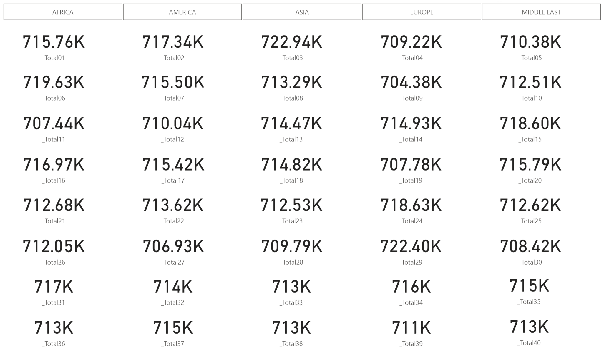

19. Note that the SQL Warehouse is running **1 cluster**.

    

20. In Power BI browser tab, open menu More Tools → Developer Tools → Network, apply filter:
    - Filter = **`query`**
    - Fetch/XHR

    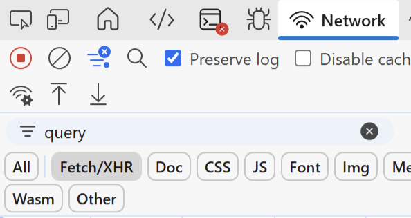


21. Using the region slicer, filter the report page by **`AFRICA`**.
    - SQL Warehouse is running `1 cluster`.
    - End-to-end page refresh time (based on the slowest visual refresh) - `18.8s`.

    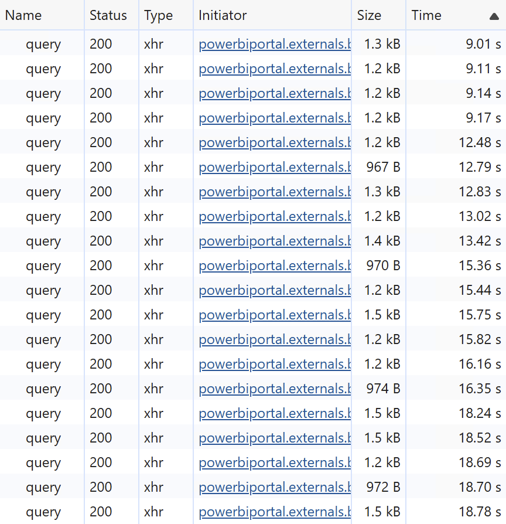

22. Clear network trace, and filter the report page by **`AMERICA`**.
    - SQL Warehouse is running `1 cluster`.
    - End-to-end page refresh time - `10.8s`.

    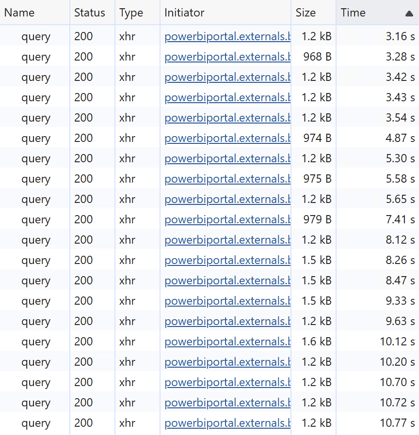

23. Clear network trace, and filter the report page by **`ASIA`**.
    - SQL Warehouse is running `1 cluster`.
    - End-to-end page refresh time - `10.8s`.

    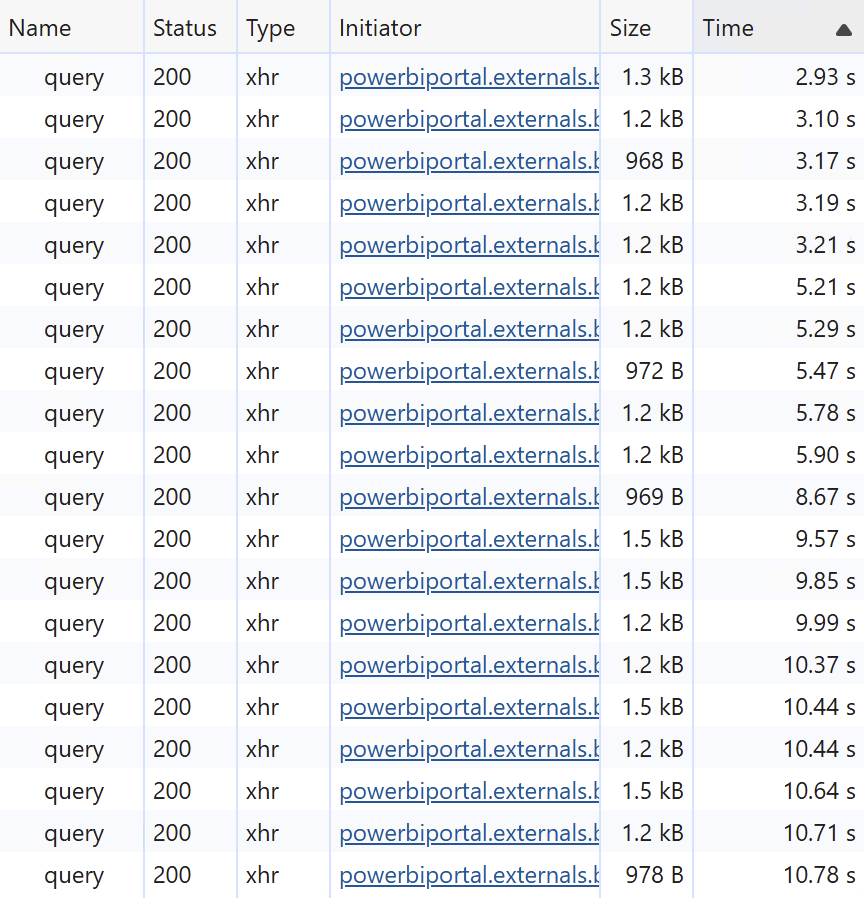

24. Clear network trace, and filter the report page by **`EUROPE`**.
    - SQL Warehouse is running `1 cluster`.
    - End-to-end page refresh time - `10.5s`.

    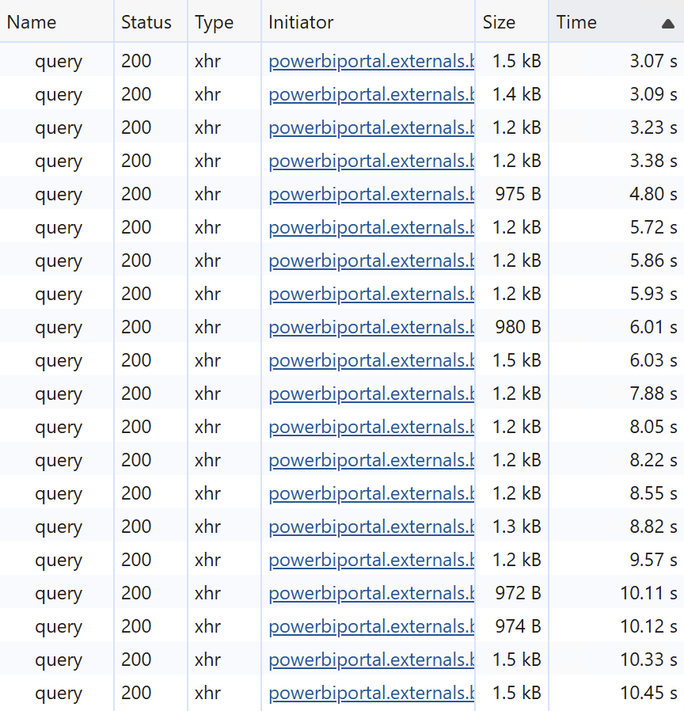

25. Clear network trace, and filter the report page by **`MIDDLE EAST`**.
    - SQL Warehouse is running `1 cluster`.
    - End-to-end page refresh time - `10.7s`.

    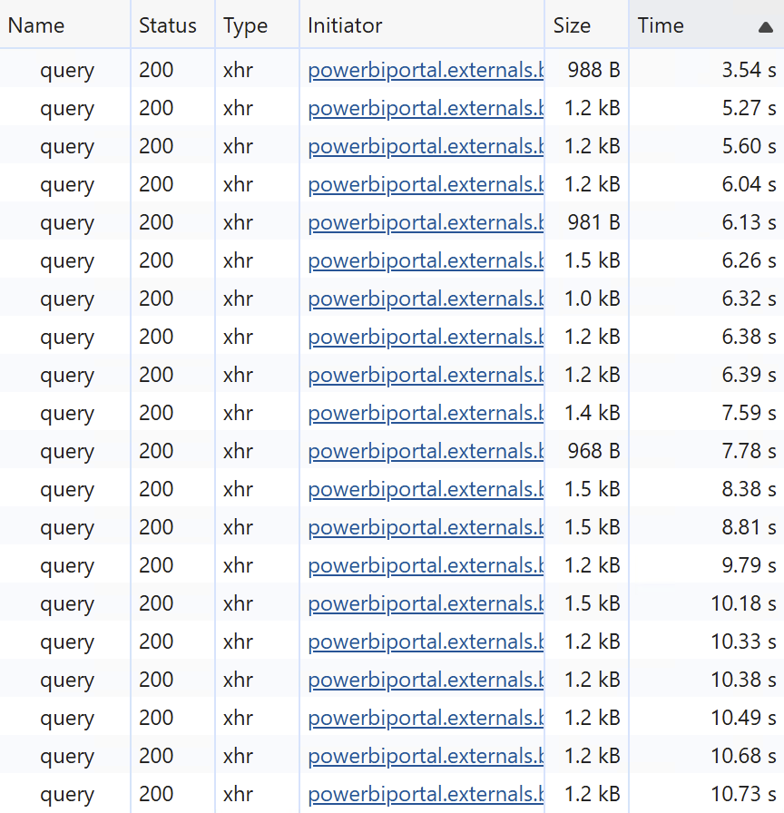


### Data Source Default Max Connections = 50
In this scenario, we test the second version of the report that uses the adjusted setting `Data Source Default Max Connections = 50`. This enables Power BI to trigger ***up to 50*** SQL queries concurrently in the data source.

26. Recreate test tables in Unity Catalog by replicating tables from **`samples`** catalog.
    ```sql
    CREATE OR REPLACE TABLE region AS SELECT * FROM samples.tpch.region;
    CREATE OR REPLACE TABLE nation AS SELECT * FROM samples.tpch.nation;
    CREATE OR REPLACE TABLE customer AS SELECT * FROM samples.tpch.customer;
    CREATE OR REPLACE TABLE part AS SELECT * FROM samples.tpch.part;
    CREATE OR REPLACE TABLE orders AS SELECT * FROM samples.tpch.orders;
    CREATE OR REPLACE TABLE lineitem AS SELECT * FROM samples.tpch.lineitem;
    ```
> [!NOTE]
> This step is required to purge all cached results from [the query result cache](https://learn.microsoft.com/en-us/azure/databricks/sql/user/queries/query-caching).

27. Restart the SQL Warehouse.
> [!NOTE]
> This step is required to purge all cached results from [the disk cache](https://learn.microsoft.com/en-us/azure/databricks/optimizations/disk-cache).

28. Open the other published report - ***Data Source Default Max Connections = 50***, wait until it's fully loaded.

29. Note that the SQL Warehouse is running **3 clusters**.
    
    

> [!NOTE]
> The reason why we observed 3 clusters here is that Power BI triggered 40 SQL queries concurrently, thus SQL Warehouse decided to scale out to 3 clusters to handle such a workload.

30. If Network trace is not yet enabled in Power BI browser tab, open menu More Tools → Developer Tools → Network, apply filter:
    - Filter = **`query`**
    - Fetch/XHR

31. Clear network trace, and filter the report page by **`AFRICA`**.
    - SQL Warehouse is running `3 clusters`.
    - End-to-end page refresh time - `13.6s`.

    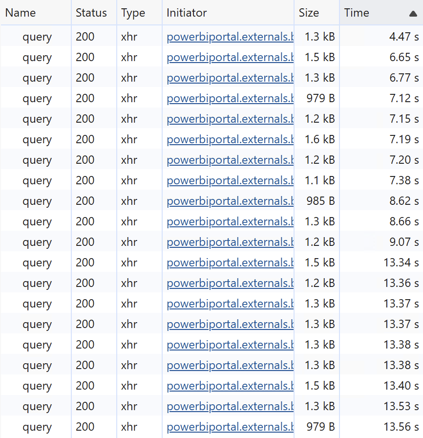

32. Clear network trace, and filter the report page by **`AMERICA`**.
    - SQL Warehouse is running `3 clusters`.
    - End-to-end page refresh time - `9.1s`.

    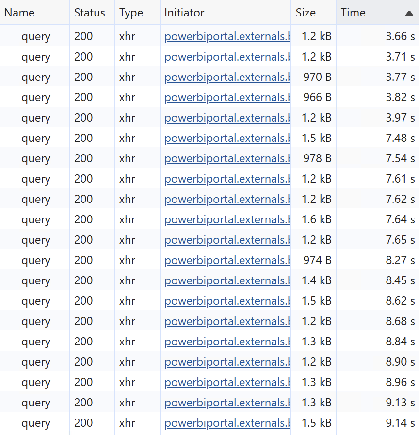

33. Clear network trace, filter the report page by **`ASIA`**.
    - SQL Warehouse is running `3 clusters`.
    - End-to-end page refresh time - `6.9s`.

    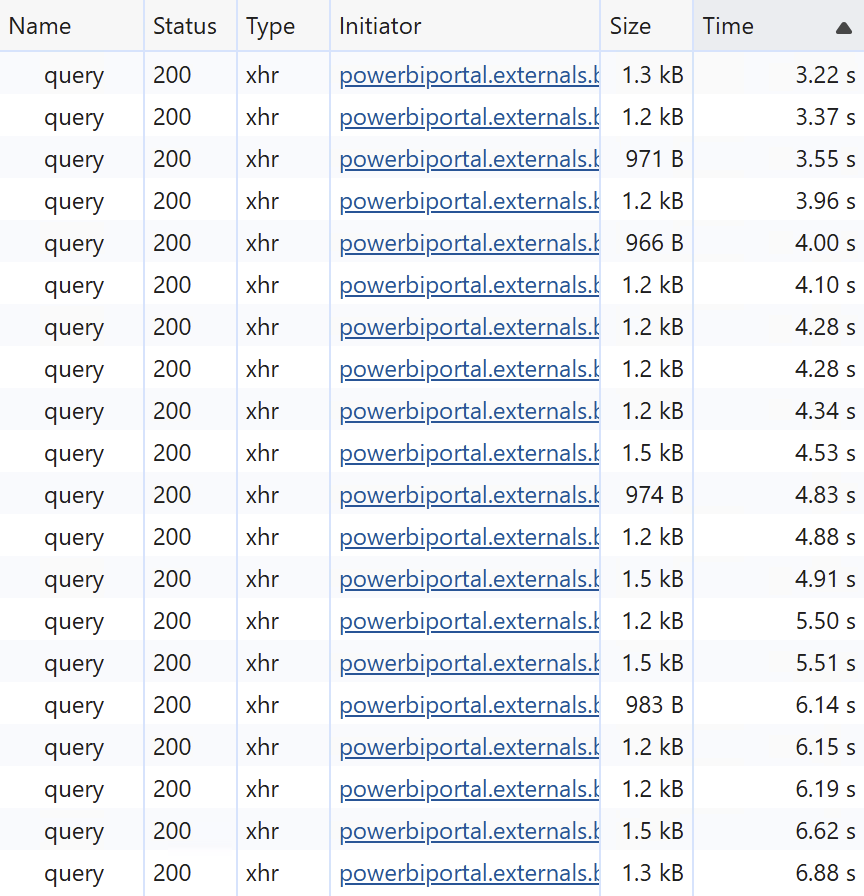

34. Clear network trace, filter the report page by **`EUROPE`**.
    - SQL Warehouse is running `3 clusters`.
    - End-to-end page refresh time - `7.6s`.

    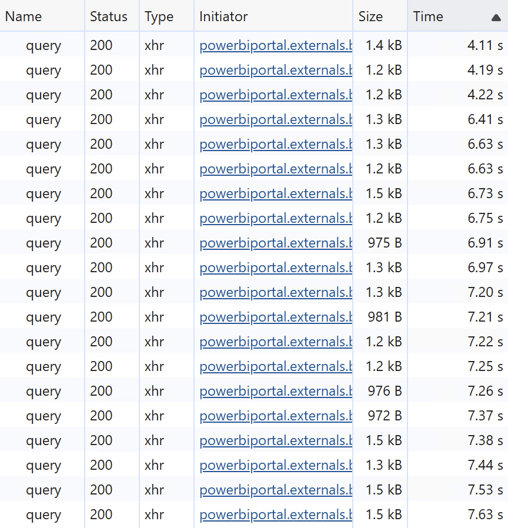

35. Clear network trace, filter the report page by **`MIDDLE EAST`**.
    - SQL Warehouse is running `3 clusters`.
    - End-to-end page refresh time - `5.4s`.

    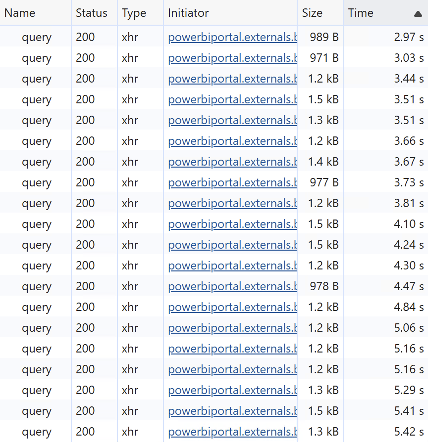


### Results
> [!IMPORTANT]
> Please note that results in your environment may differ from those reported here, but the overall trends should remain consistent.
> The results reported here were achieved on Power BI **P1** capacity and **Serverless** SQL Warehouse, **Small** cluster size, min **1**, max **5**.

|  Max Connections | Filter       | Clusters | Refresh time, s |
| ---------------- | ------------ | -------- | --------------- |
| 10               | AFRICA       | 1        | 18.8            |
| 10               | AMERICA      | 1        | 10.8            |
| 10               | ASIA         | 1        | 10.8            |
| 10               | EUROPE       | 1        | 10.5            |
| 10               | MIDDLE EAST  | 1        | 10.7            |
| 50               | AFRICA       | 3        | 13.6            |
| 50               | AMERICA      | 3        | 9.1             |
| 50               | ASIA         | 3        | 6.9             |
| 50               | EUROPE       | 3        | 7.6             |
| 50               | MIDDLE EAST  | 3        | 5.4             |


## Conclusion

When using the default setting of **Data Source Default Max Connections**, that is 10, we observed steady end-to-end performance of roughly 10-11 seconds starting from the second filter.
The default setting of 10 helps prevent overloading data sources with excessive parallel SQL queries generated by complex Power BI reports.

While this might be relevant for some data sources, Databricks SQL Serverless is able to scale in and out quickly based on actual workload.
Increasing **Data Source Default Max Connections** to 50 delivered notably faster performance at about 5-9 seconds starting with the second filter.

Tuning **Data Source Default Max Connections** is most beneficial for high-concurrency scenarios. For low concurrency, setting it too high can trigger unnecessary scale-out and degrade user experience.

You can find more information on how **Data Source Default Max Connections** impacts Power BI query parallelization [here](https://learn.microsoft.com/en-us/power-bi/guidance/directquery-model-guidance#optimize-model-design). Please note that the maximum effective value of **Data Source Default Max Connections** is subject for [Power BI SKU limitations](https://learn.microsoft.com/en-us/fabric/enterprise/powerbi/service-premium-what-is#semantic-model-sku-limitation).

> [!IMPORTANT]
> Please note that **Data Source Default Max Connections** and **Max Parallelism Per Query** settings work differently.
> - **Max Parallelism Per Query** defines how many SQL queries generated for ***a single DAX-query*** (a single visual) can be triggered concurrently.
> - **Data Source Default Max Connections** defines how many SQL queries ***in total*** can be triggered concurrently by a semantic model. This includes all SQL queries generated for all all users for all DAX-queries (all visuals).


## Power BI template

Power BI templates [Data Source Default Max Connections = 10.pbit](./Data%20Source%20Default%20Max%20Connections%20=%2010.pbit) and [Data Source Default Max Connections = 50.pbit](./Data%20Source%20Default%20Max%20Connections%20=%2050.pbit) as well [Data Source Default Max Connections.sql](./Data%20Source%20Default%20Max%20Connections.sql) script are provided in this folder to demonstrate the performance difference when adjusting **Data Source Default Max Connections** setting outlined above. To use the templates, simply enter your Databricks SQL Warehouse's **`ServerHostname`** and **`HttpPath`**, along with the **`Catalog`** and **`Schema`** names that correspond to the environment set up in the instructions above.
