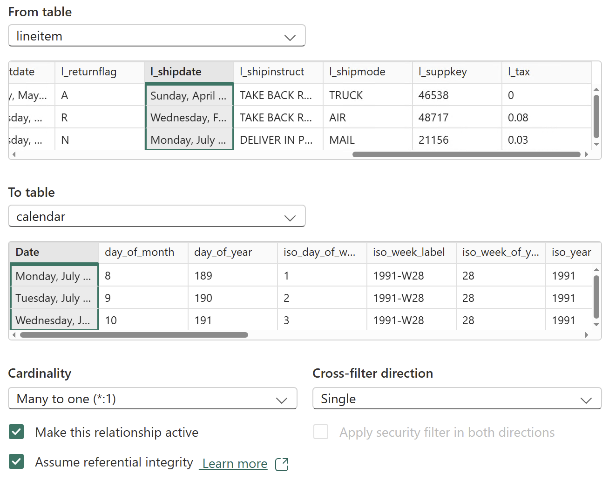
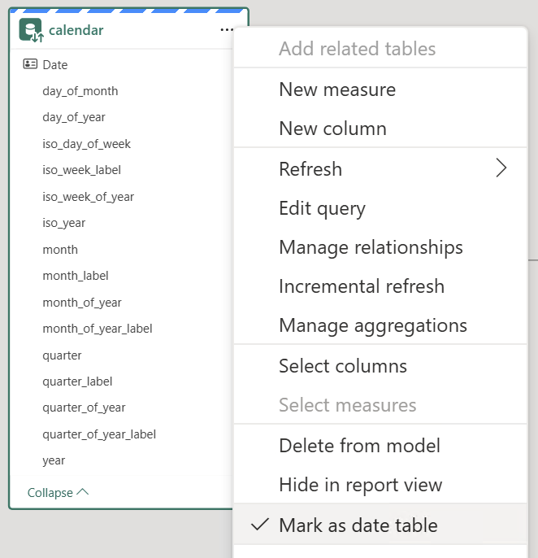
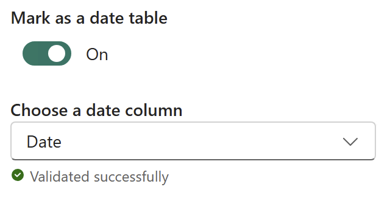
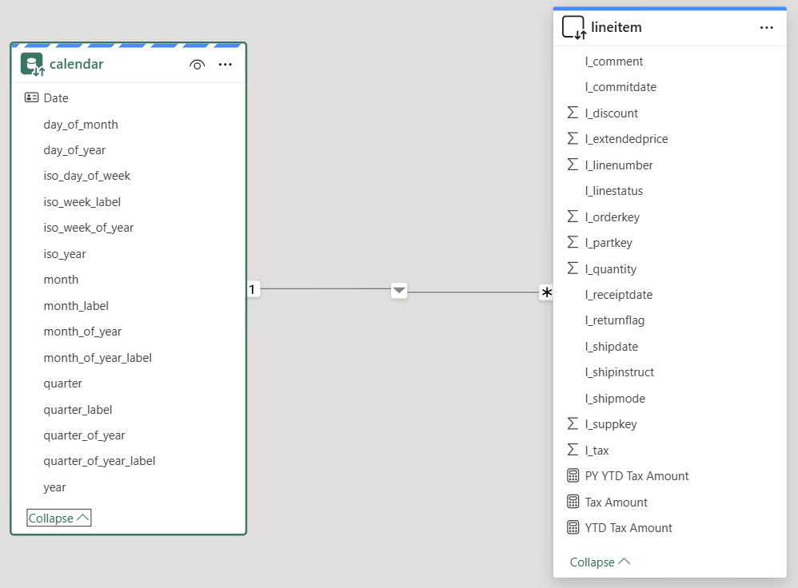
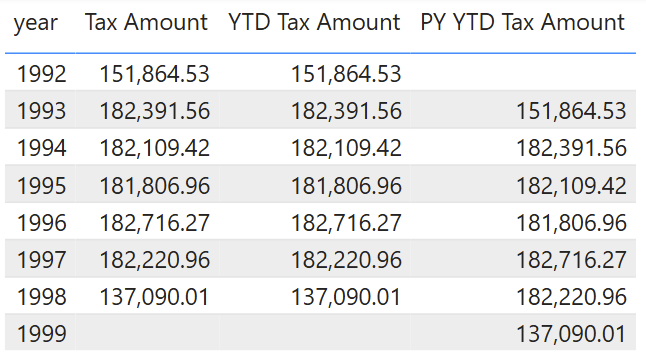
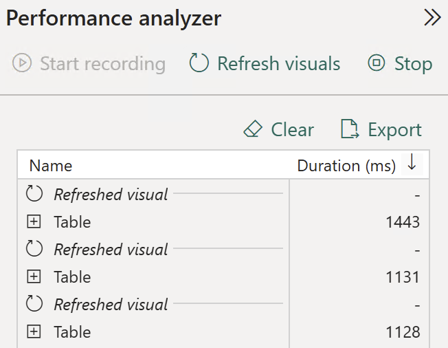
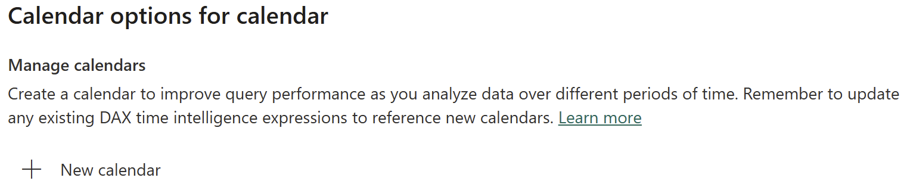
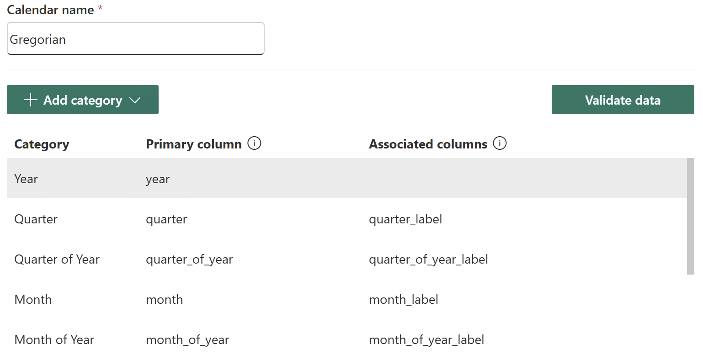
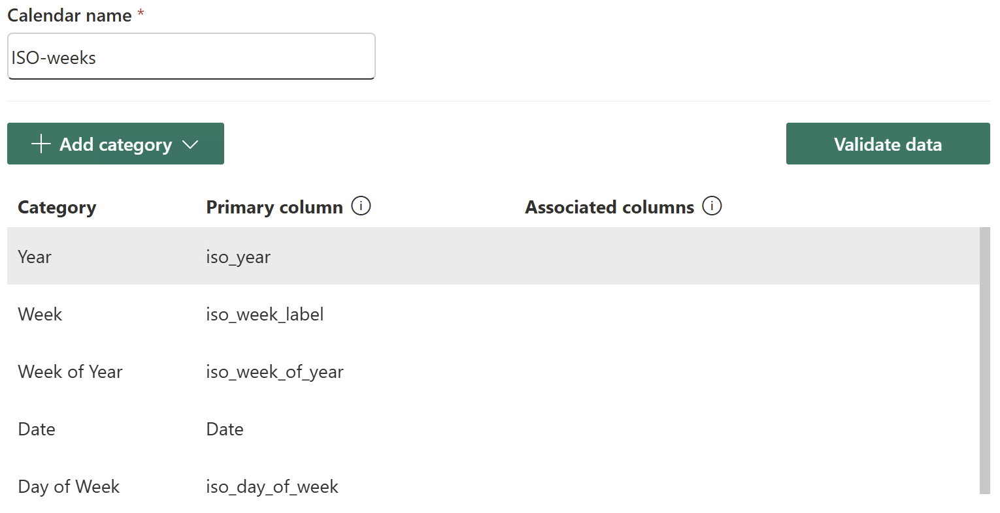
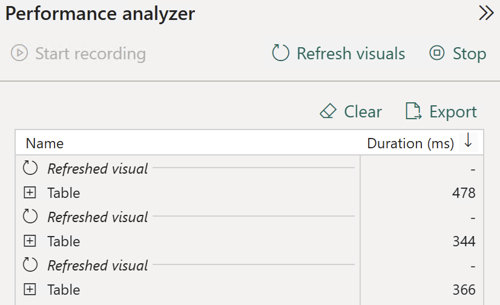

# Calendar-based Time Intelligence

## Introduction

**Time Intelligence** is central to many analytics scenarios, from sales and inventory to financial planning, but classic time intelligence calculations in Power BI have been historically less efficient in **DirectQuery** mode. With the introduction of [Calendar-based time intelligence](https://learn.microsoft.com/en-us/power-bi/transform-model/desktop-time-intelligence#calendar-based-time-intelligence-preview), DirectQuery semantic models can now execute time intelligence calculations far more efficiently, unlocking faster and more scalable reporting.

This quickstart demonstrates how to take advantage of [Calendar-based time intelligence](https://learn.microsoft.com/en-us/power-bi/transform-model/desktop-time-intelligence#calendar-based-time-intelligence-preview) in Power BI, highlighting its practical benefits.


## Prerequisites

Before you begin, ensure you have the following:

- [Databricks account](https://databricks.com/), access to a Databricks workspace, Unity Catalog, and SQL Warehouse
- [Databricks SQL Warehouse](https://docs.databricks.com/gcp/en/compute/sql-warehouse/)
- [Power BI Desktop](https://powerbi.microsoft.com/desktop/), latest version is highly recommended


  
## Step by step walkthrough

### Preparation

1. Create a catalog and a schema in Databricks Unity Catalog.
    ```sql
    CREATE CATALOG IF NOT EXISTS powerbiquickstarts;
    USE CATALOG powerbiquickstarts;
    CREATE SCHEMA IF NOT EXISTS tpch;
    USE SCHEMA tpch;
    ```

2. Create tables in the catalog by replicating tables from **`samples`** catalog.
    ```sql
    CREATE OR REPLACE TABLE region AS SELECT * FROM samples.tpch.region;
    CREATE OR REPLACE TABLE nation AS SELECT * FROM samples.tpch.nation;
    CREATE OR REPLACE TABLE customer AS SELECT * FROM samples.tpch.customer;
    CREATE OR REPLACE TABLE part AS SELECT * FROM samples.tpch.part;
    CREATE OR REPLACE TABLE orders AS SELECT * FROM samples.tpch.orders;
    CREATE OR REPLACE TABLE lineitem AS SELECT * FROM samples.tpch.lineitem;
    ```

3. Create calendar dimension table by using the following script.
    ```sql
    CREATE OR REPLACE TABLE calendar AS
    WITH cte AS (
    SELECT explode(sequence(DATE '1991-01-01', DATE '2000-12-31')) AS calendar_date
    )
    SELECT 
        calendar_date as `Date`,
        -- Gregorian attributes
        year(calendar_date)                                                                             AS year,
        quarter(calendar_date)                                                                          AS quarter_of_year,
        format_string('Q%d', quarter(calendar_date))                                                    AS quarter_of_year_label,
        year(calendar_date)*100+quarter(calendar_date)                                                  AS quarter,
        format_string('%d-Q%d', year(calendar_date), quarter(calendar_date))                            AS quarter_label,
        month(calendar_date)                                                                            AS month_of_year,
        year(calendar_date)*100+month(calendar_date)                                                    AS month,
        date_format(calendar_date, 'MMMM')                                                              AS month_of_year_label,
        date_format(calendar_date, 'MMMM yyyy')                                                         AS month_label,
        day(calendar_date)                                                                              AS day_of_month,
        dayofyear(calendar_date)                                                                        AS day_of_year,
        -- ISO week-based attributes
        extract(YEAROFWEEK FROM calendar_date)                                                          AS iso_year,            -- ISO week-year
        weekofyear(calendar_date)                                                                       AS iso_week_of_year,    -- 1–52/53
        format_string('%d-W%02d', extract(YEAROFWEEK FROM calendar_date), weekofyear(calendar_date))    AS iso_week_label,      -- e.g. 2023-W50
        extract(DAYOFWEEK_ISO FROM calendar_date)                                                       AS iso_day_of_week     -- 1=Mon..7=Sun
    FROM cte;

    ALTER TABLE calendar ALTER COLUMN `Date` SET NOT NULL;
    ALTER TABLE calendar ADD CONSTRAINT pk_calendar PRIMARY KEY(`Date`);
    ALTER TABLE lineitem ADD CONSTRAINT fk_calendar FOREIGN KEY(l_shipdate) REFERENCES calendar NOT ENFORCED RELY;
    ```

### Classic time intelligence

4. Open Power BI Desktop → **Home** → **Get Data** → **More...**.

5. Search for **Databricks** and select **Azure Databricks** (or **Databricks** when using Databricks on AWS or GCP).

6. Enter the following values:
   - **Server Hostname**: Enter the Server hostname value from Databricks SQL Warehouse connection details tab.
   - **HTTP Path**: Enter the HTTP path value  from Databricks SQL Warehouse connection details tab.

> [!TIP]
> We recommend parameterizing your connections. This really helps ease out the Power BI development and administration expeience as you can easily switch between different environments, i.e., Databricks Workspaces and SQL Warehouses. For details on how to paramterize your connection string, you can refer to [Connection Parameters](/01.%20Connection%20Parameters/) article.

7. Connect to Databricks SQL Warehouse, **`powerbiquickstarts`** catalog, **`tpch`** schema, and add the following tables to the semantic model. **DirectQuery** storage mode should be set as default.
    - `lineitem`
    - `calendar`

8. Using Model view set the storage mode for **`calendar`** table as **Dual**.

9. If the table relationship was not created by Power BI Desktop automatically, create the table relationship as shown on the picture below.
    
    

10. Mark **`calendar`** table as date table.
    
    
    

11. Create DAX-measures in the **`lineitem`** table using the follow expressions.
    ```
    Tax Amount = SUM ( lineitem[l_tax] )
    YTD Tax Amount = CALCULATE ( [Tax Amount], DATESYTD ( 'calendar'[Date] ) )
    PY YTD Tax Amount = CALCULATE ([YTD Tax Amount], SAMEPERIODLASTYEAR ( 'calendar'[Date] ))
    ```

12. The data model should look as shown below.
    
    

13. Add a table visual to the report page. Add columns to the table visual. Disable Totals in the table visual format settings.
    - `year`
    - `Tax Amount`
    - `YTD Tax Amount`
    - `PY YTD Tax Amount`

14. The report page should look as shown below.
    
    

15. Open Performance Analyzer. **Optimize** → **Performance analyzer** → **Start recording**.

16. Refresh the report multiple times by clicking **Refresh visuals**. Note the refresh durations for the table visual.
        

17. Open Databricks workspace UI → **Query History**. Explore SQL-queries triggered by Power BI.

18. For every report refresh, Power BI Desktop triggers 3 SQL-queries. 1 SQL query per measure used in the table visual.

19. Explore the SQL-queries text. You can see that Power BI Desktop generated 2 SQL-queries at ***day*** granularity (filter in `Date` column), though the report expects ***year*** granularity. Namely for measures `YTD Tax Amount` and `PY YTD Tax Amount`. These queries return **2,526** records that must be further aggregated on Power BI side.
    ```sql
    ...
        inner join (
            select
            `Date`,
            `year`,
            ...
            from
            `powerbiquickstarts`.`tpch`.`calendar`
            where
            (
                `Date` in (
                { d '1993-08-12' },
                ...
                { d '1993-01-14' }
                )
            )
            or (
                `Date` in (
                { d '1993-02-24' },
                ...
                { d '1999-04-21' }
                )
            )
        ) as `ITBL`
    ```

20. Switch to Power BI Desktop. Save the report as local file. Close Power BI Desktop.


### Calendar-based time intelligence

21. Open Power BI Desktop → **File** → **Options and settings** → **Options** → **Preview features**. Enable **Enhanced DAX Time Intelligence**. Restart Power BI Desktop if required.

    

22. Re-open previously saved report.

23. Switch to Model view, select **`calendar`** table. Note **Calendar options** on the toolbar. Click **Calendar options**.

    

24. Create a new calendar and configure it as shown below.

    

    | Category            | Primary column  | Associated columns    |
    | ------------------- | --------------- | --------------------- |
    | Year                | year            |                       |
    | Quarter             | quarter         | quarter_label         |
    | Quarter of Year     | quarter_of_year | quarter_of_year_label |
    | Month               | month           | month_label           |
    | Month of Year       | month_of_year   | month_of_year_label   |
    | Date                | Date            |                       |
    | Day of Year         | day_of_year     |                       |
    | Day of Month        | day_of_month    |                       |

    

25. Click **Validate data**. Make sure there are no errors. Click **Save and close**.

26. Optionally, you may want to create another calendar for ISO-weeks.

    | Category            | Primary column   | Associated columns    |
    | ------------------- | ---------------- | --------------------- |
    | Year                | iso_year         |                       |
    | Week                | iso_week_label   |                       |
    | Quarter of Year     | iso_week_of_year |                       |
    | Date                | Date             |                       |
    | Day of Week         | iso_day_of_week  |                       |

    

27. Update DAX-measures in the **`lineitem`** table as shown below. Note the new syntax for `DATESYTD` and `SAMEPERIODLASTYEAR` functions.

    ```
    Tax Amount = SUM ( lineitem[l_tax] )
    YTD Tax Amount = CALCULATE ( [Tax Amount], DATESYTD ( Calendar('Gregorian')) )
    PY YTD Tax Amount = CALCULATE ([YTD Tax Amount], SAMEPERIODLASTYEAR ( Calendar('Gregorian') ))
    ```

28. Open Performance Analyzer. **Optimize** → **Performance analyzer** → **Start recording**.

29. Refresh the report multiple times by clicking **Refresh visuals**. Note the refresh durations for the table visual.

    

30. Open Databricks workspace UI → **Query History**. Explore SQL-queries triggered by Power BI.

31. For every report refresh, Power BI Desktop triggers 3 SQL-queries. 1 SQL query per measure used in the table visual.

32. Explore the SQL-queries text. You can see that now Power BI Desktop generates queries at ***year*** granularity (filter on `year` column). This results in returning only **7** records, i.e., fully aggregated resultset, therefore no need for further aggregation on Power BI side.

    ```sql
    ...
        inner join (
            select
                `Date`,
                `year`,
                ...
            from
                `powerbiquickstarts`.`tpch`.`calendar`
            where
                `year` in (1991, 1992, 1993, 1994, 1995, 1996, 1997, 1998, 1999, 2000)
        ) as `ITBL`
    ...
    ```

33. Switch to Power BI Desktop. Save the report as local file. Close Power BI Desktop.


## Conclusion

Calendar-based time intelligence delivers a clear performance win for DirectQuery reports on Databricks. In our example, refresh times improved from **over 1 second** with [Classic time intelligence](https://learn.microsoft.com/en-us/power-bi/transform-model/desktop-time-intelligence#classic-time-intelligence) to under **0.5 seconds** with [Calendar-based time intelligence](https://learn.microsoft.com/en-us/power-bi/transform-model/desktop-time-intelligence#calendar-based-time-intelligence-preview), thanks to more efficient SQL generated by Power BI
- aggregating at the correct granularity level
- returning smaller result sets
- and producing shorter queries.

This approach substantially reduces the historical friction of using time intelligence calculations in DirectQuery mode and demonstrates how the newer [Calendar-based time intelligence](https://learn.microsoft.com/en-us/power-bi/transform-model/desktop-time-intelligence#calendar-based-time-intelligence-preview) can make demanding, time-aware analytics in Power BI on Databricks both faster and more scalable.


> [!IMPORTANT]
> Please note that leveraging this new feature in the existing semantic models will require adjusting DAX-expressions to accomodate the new syntax.


## Power BI template

Power BI templates [Time Intelligence - classic.pbit](./??) and [Time Intelligence - calendar-based.pbit](./???) as well [Time Intelligence.sql](./Time%20Intelligence.sql) script are provided in this folder to demonstrate the performance difference when using **Calendar-based time intelligence** outlined above. To use the templates, simply enter your Databricks SQL Warehouse's **`ServerHostname`** and **`HttpPath`**, along with the **`Catalog`** and **`Schema`** names that correspond to the environment set up in the instructions above.
