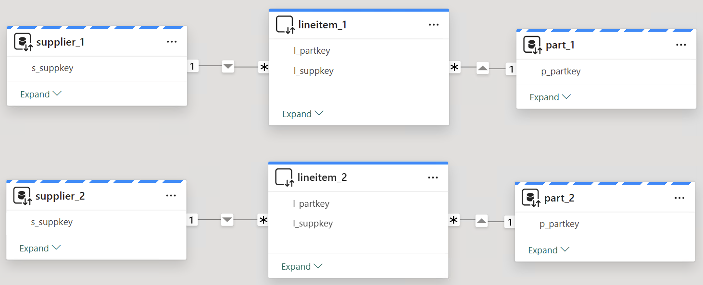
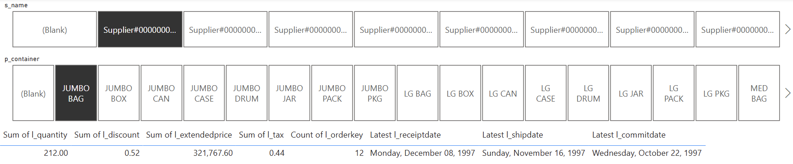
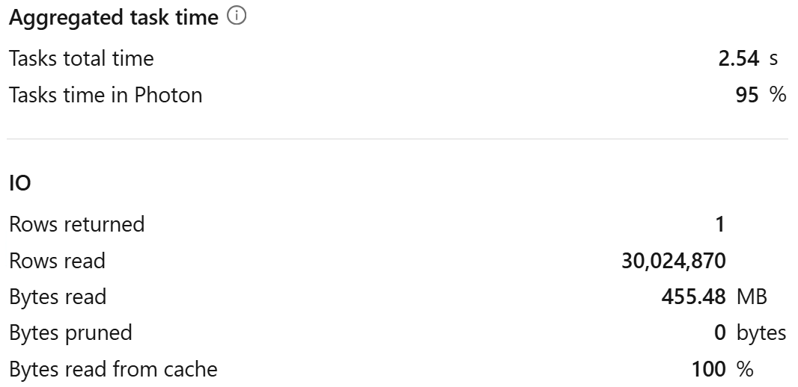
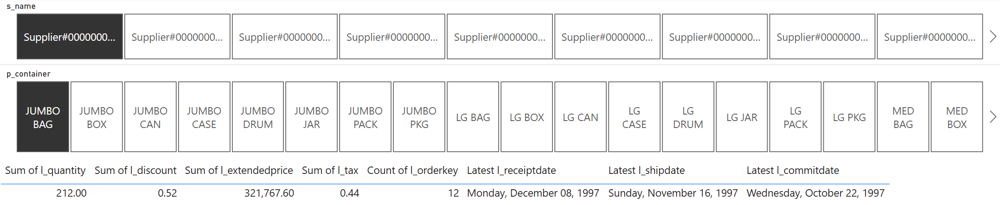
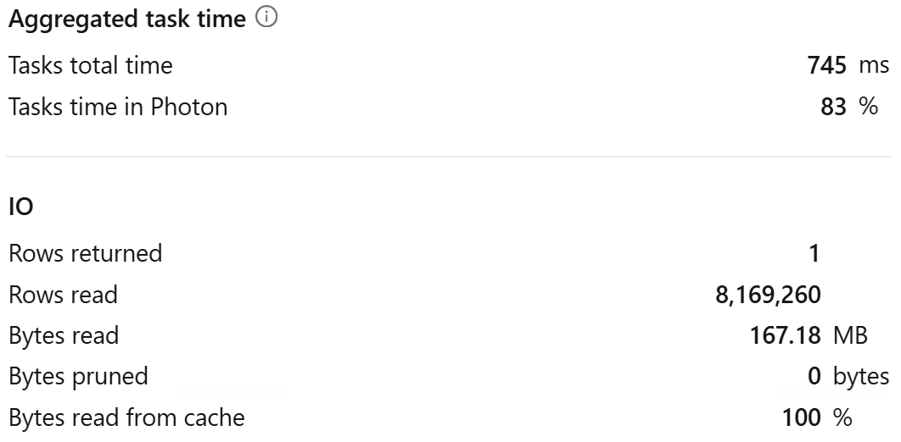

# Referential Integrity

## Introduction

Understanding how Power BI generates SQL-queries when using _DirectQuery_ or _Composite Models_ and modeling data accordingly is crucial for achieving optimal performance.

In this quickstart, we explore how [Assume referential integrity](https://learn.microsoft.com/en-us/power-bi/connect-data/desktop-assume-referential-integrity) in Power BI semantic model can help improve query execution efficiency in Databricks SQL to achieve better performance and scalability. You can follow the steps mentioned in the [Step by step walkthrough](#step-by-step-walkthrough) section.


## Prerequisites

Before you begin, ensure you have the following:

- [Databricks account](https://databricks.com/), access to a Databricks workspace, Unity Catalog, and Databricks SQL Warehouse
- [Power BI Desktop](https://powerbi.microsoft.com/desktop/), latest version is highly recommended


## Step by step walkthrough

### Preparation

1. Create a catalog in Databricks Unity Catalog.
    ```sql
    CREATE CATALOG IF NOT EXISTS powerbiquickstarts;
    USE CATALOG powerbiquickstarts;
    ```

2. Create schema **`tpch`** and tables by replicating tables from **`samples`** catalog.
    ```sql
    CREATE SCHEMA IF NOT EXISTS tpch;
    USE SCHEMA tpch;

    CREATE OR REPLACE TABLE part AS SELECT * FROM samples.tpch.part;
    CREATE OR REPLACE TABLE supplier AS SELECT * FROM samples.tpch.supplier;
    CREATE OR REPLACE TABLE lineitem AS SELECT * FROM samples.tpch.lineitem;

    ALTER TABLE part ALTER COLUMN p_partkey SET NOT NULL;
    ALTER TABLE supplier ALTER COLUMN s_suppkey SET NOT NULL;

    ALTER TABLE part ADD CONSTRAINT pk_part PRIMARY KEY(p_partkey) RELY;
    ALTER TABLE supplier ADD CONSTRAINT pk_supplier PRIMARY KEY(s_suppkey) RELY;

    ALTER TABLE lineitem ADD CONSTRAINT fk_parts FOREIGN KEY(l_partkey) REFERENCES part NOT ENFORCED RELY;
    ALTER TABLE lineitem ADD CONSTRAINT fk_supplier FOREIGN KEY(l_suppkey) REFERENCES supplier NOT ENFORCED RELY;

    CREATE OR REPLACE VIEW v_lineitem AS SELECT *, now() as currenttime FROM lineitem;

    ALTER TABLE lineitem CLUSTER BY (l_suppkey, l_partkey);
    OPTIMIZE lineitem FULL;
    ```

3. Create schema **`tpch_nointegrity`** and tables by replicating tables from **`samples`** catalog.


    ```sql
    CREATE SCHEMA IF NOT EXISTS tpch_nointegrity;
    USE SCHEMA tpch_nointegrity;

    CREATE OR REPLACE TABLE part 
    AS SELECT
        CAST(p_partkey AS INT) AS p_partkey,
        p_name,
        p_mfgr,
        p_brand,
        p_type,
        p_size,
        p_container,
        p_retailprice,
        p_comment
    FROM samples.tpch.part;
    
    CREATE OR REPLACE TABLE supplier
    AS SELECT
        CAST(s_suppkey AS INT) AS s_suppkey,
        s_name,
        s_address,
        s_nationkey,
        s_phone,
        s_acctbal,
        s_comment
    FROM samples.tpch.supplier;

    CREATE OR REPLACE TABLE lineitem AS SELECT * FROM samples.tpch.lineitem;

    ALTER TABLE part ALTER COLUMN p_partkey SET NOT NULL;
    ALTER TABLE supplier ALTER COLUMN s_suppkey SET NOT NULL;

    ALTER TABLE part ADD CONSTRAINT pk_part PRIMARY KEY(p_partkey) RELY;
    ALTER TABLE supplier ADD CONSTRAINT pk_supplier PRIMARY KEY(s_suppkey) RELY;

    ALTER TABLE lineitem ADD CONSTRAINT fk_parts FOREIGN KEY(l_partkey) REFERENCES part NOT ENFORCED RELY;
    ALTER TABLE lineitem ADD CONSTRAINT fk_supplier FOREIGN KEY(l_suppkey) REFERENCES supplier NOT ENFORCED RELY;

    CREATE OR REPLACE VIEW v_lineitem AS SELECT *, now() as currenttime FROM lineitem;

    ALTER TABLE lineitem CLUSTER BY (l_suppkey, l_partkey);
    OPTIMIZE lineitem FULL;    
    ```

> [!IMPORTANT]
> Though schemas `tpch` and `tpch_nointegrity` look similar, there are important differences. The schema `tpch_nointegrity` intentionally contains suboptimal tables. We will demonstrate the impact later in this quickstart.


4. Open Power BI Desktop → **"Home"** → **"Get Data"** → **"More..."**.

5. Search for **Databricks** and select **Azure Databricks** (or **Databricks** when using Databricks on AWS or GCP).

6. Enter the following values:
   - **Server Hostname**: Enter the Server hostname value from Databricks SQL Warehouse connection details tab.
   - **HTTP Path**: Enter the HTTP path value  from Databricks SQL Warehouse connection details tab.

> [!TIP]
> We recommend parameterizing your connections. This really helps ease out the Power BI development and administration expeience as you can easily switch between different environments, i.e., Databricks Workspaces and SQL Warehouses. For details on how to paramterize your connection string, you can refer to [Connection Parameters](/01.%20Connection%20Parameters/) article.

7. Connect to **`powerbiquickstarts`** catalog.

8. Add tables as follows.

    | Schema           | Table      | Storage Mode | Alias      |
    | ---------------- | ---------- | ------------ | ---------- |
    | tpch_nointegrity | part       | Dual         | part_1     |
    | tpch_nointegrity | supplier   | Dual         | supplier_1 |
    | tpch_nointegrity | v_lineitem | DirectQuery  | lineitem_1 |
    | tpch             | part       | Dual         | part_2     |
    | tpch             | supplier   | Dual         | supplier_2 |
    | tpch             | v_lineitem | DirectQuery  | lineitem_2 |

> [!IMPORTANT]
> Here we use `v_lineitem` view, not `lineitem` table. The view uses `now()` function that prevents QRC (Query Result Caching). Therefore, we will be able to analyze query profiles even after multiple report refreshes.

9. If relationships are not created automatically, create table relationships as follows.
   - **`part_1`** → **`lineitem_1`** 
   - **`supplier_1`** → **`lineitem_1`** 
   - **`part_2`** → **`lineitem_2`** 
   - **`supplier_2`** → **`lineitem_2`**

10. Ensure that for the former 2 relationships - **`part_1`** → **`lineitem_1`** and **`supplier_1`** → **`lineitem_1`** - ***Assume referential integrity*** setting is switched **OFF**.

    

11. Ensure that for the latter 2 relationships - **`part_2`** → **`lineitem_2`** and **`supplier_2`** → **`lineitem_2`** - ***Assume referential integrity*** setting is switched **ON**.

    

12. The semantic model should look like on the screenshot below.

    


### No integrity

13. Create a report page **No integrity** and **Referential integrity**.

14. Add a table visual. Use tables **lineitem_1**, **part_1**, **supplier_1**. Add columns as follows:
    - Sum of **`l_quantity`**
    - Sum of **`l_discount`**
    - Sum of **`l_extendedprice`**
    - Sum of **`l_tax`**
    - Count (Distinct) of **`l_orderkey`**
    - Latest **`l_receiptdate`**
    - Latest **`l_shipdate`**
    - Latest **`l_commitdate`**

15. Add slicers as follows:
    - **s_name** - `Supplier#000000001`
    - **p_container** - `JUMBO BAG`.

16. The report should look like on the screenshot below.
    
    

17. Open Performance Analyzer - **Optimize** → **Performance Analyzer** → **Start Recording** → **Refresh visuals**. Wait until refresh is completed.

18. Open Databricks Query History. Notice the latest SQL-query from Power BI. Open the query profile.

    

19. We can see that the total tasks time was **2.54s** and bytes read **455MB**.

> [!NOTE]
> Total tasks time is the combined time it took to execute the query across all cores of all nodes. This is not the same as total wall-clock duration that is the total elapsed time between the start of scheduling and the end of the query execution.

20. Check also the SQL-query text.

    ``` sql
    select
        SUM(`l_tax`) as `C1`, ...
    from
    (
        select
            ...
        from
        (
            select
                ...
            from
            `powerbiquickstarts`.`tpch_nointegrity`.`v_lineitem` as `OTBL`
                left outer join `powerbiquickstarts`.`tpch_nointegrity`.`part` as `ITBL`
                on (cast(`OTBL`.`l_partkey` as DOUBLE) = cast(`ITBL`.`p_partkey` as DOUBLE))
            where
            `ITBL`.`p_container` = 'JUMBO BAG'
        ) as `OTBL`
            left outer join `powerbiquickstarts`.`tpch_nointegrity`.`supplier` as `ITBL`
            on (cast(`OTBL`.`l_suppkey` as DOUBLE) = cast(`ITBL`.`s_suppkey` as DOUBLE))
        where
        `ITBL`.`s_name` = 'Supplier#000000001'
    ) as `ITBL`
    ```


### Referential Integrity

22. Create a report page **Referential integrity**.

23. Add a table visual. Use tables **lineitem_2**, **part_2**, **supplier_2**. Add columns as follows:
    - Sum of **`l_quantity`**
    - Sum of **`l_discount`**
    - Sum of **`l_extendedprice`**
    - Sum of **`l_tax`**
    - Count (Distinct) of **`l_orderkey`**
    - Latest **`l_receiptdate`**
    - Latest **`l_shipdate`**
    - Latest **`l_commitdate`**

24. Add slicers as follows:
    - **s_name** - `Supplier#000000001`
    - **p_container** - `JUMBO BAG`.

25. The report should look like on the screenshot below.
    
    

26. Open Performance Analyzer - **Optimize** → **Performance Analyzer** → **Start Recording** → **Refresh visuals**. Wait until refresh is completed.

27. Open Databricks Query History. Notice the latest SQL-query from Power BI. Open the query profile.

    

28. We can see that the total tasks time was **754ms** and bytes read **167MB**.

29. Check also the SQL-query text.

    ``` sql
    select
        SUM(`l_tax`) as `C1`, ...
    from
    (
        select
            ...
        from
        (
            select
                ...
            from
                `powerbiquickstarts`.`tpch`.`v_lineitem` as `OTBL`
                inner join (
                    select
                        ...
                    from
                        `powerbiquickstarts`.`tpch`.`part`
                    where
                        `p_container` = 'JUMBO BAG'
                ) as `ITBL`
                on (`OTBL`.`l_partkey` = `ITBL`.`p_partkey`)
        ) as `OTBL`
            inner join (
                select
                    ...
                from
                    `powerbiquickstarts`.`tpch`.`supplier`
                where
                    `s_name` = 'Supplier#000000001'
            ) as `ITBL`
            on (`OTBL`.`l_suppkey` = `ITBL`.`s_suppkey`)
    ) as `ITBL`
    ```


### Analysis

We observed that in the second test SQL Warehouse spent significant less time on execution (*Total tasks time*) and read significant less data (*Bytes read*). Why did it happen?
If we check both SQL-queries above, we will see that in the first test Power BI generated the query using **`left outer join`** and **`cast`** on join key columns.

```sql
...
from `powerbiquickstarts`.`tpch_nointegrity`.`v_lineitem` as `OTBL`
    left outer join `powerbiquickstarts`.`tpch_nointegrity`.`part` as `ITBL`
        on (cast(`OTBL`.`l_partkey` as DOUBLE) = cast(`ITBL`.`p_partkey` as DOUBLE))
...
```

While in the second test Power BI generated the query using **`inner join`** without cast on join key columns.

```sql
...
`powerbiquickstarts`.`tpch`.`v_lineitem` as `OTBL`
    inner join (
        select
            ...
        from
            `powerbiquickstarts`.`tpch`.`part`
        where
            `p_container` = 'JUMBO BAG'
    ) as `ITBL`
    on (`OTBL`.`l_partkey` = `ITBL`.`p_partkey`)
...
```

Power BI uses `LEFT OUTER JOIN` in SQL-queries by default. However, when [Assume referential integrity](https://learn.microsoft.com/en-us/power-bi/connect-data/desktop-assume-referential-integrity) setting is enabled for a relationship, Power BI uses `INNER JOIN`.

Additionally, Power BI uses CAST on join key columns if column data types are not the same. In our case we used BIGINT for dimension table columns and INT for fact table columns. Therefore, Power BI used ``cast(`OTBL`.`l_partkey` as DOUBLE) = cast(`ITBL`.`p_partkey` as DOUBLE)``.

Altogether `LEFT OUTER JOIN` and `CAST` resulted in less efficient query execution, though the result was correct. By aligning data types of the columns participating in `JOIN` and enabling [Assume referential integrity](https://learn.microsoft.com/en-us/power-bi/connect-data/desktop-assume-referential-integrity) setting on the relationships, we managed to achieve more efficient query execution. Though total wall-clock duration difference in our test was negligible, `Total tasks time` and `Bytes read` metrics were significantly improved after applying optimizations. This may be even more important as data volume and the number of concurrent queries grow.

> [!IMPORTANT]
> Please pay attention to [Requirements for Assume referential integrity](https://learn.microsoft.com/en-us/power-bi/connect-data/desktop-assume-referential-integrity#requirements-for-using-assume-referential-integrity).  The following requirements are necessary for Assume referential integrity to work properly:
>- Data in the **From** column in the relationship is never Null or blank
>- For each value in the **From** column, there's a corresponding value in the **To** column.
>
> Using this setting when the requirements are not met can lead to incorrect results in reports.


## Conclusion

Using the same data types for join key columns and [Assume referential integrity](https://learn.microsoft.com/en-us/power-bi/connect-data/desktop-assume-referential-integrity) setting (where appropriate) can help significantly improve query execution efficiency when using _DirectQuery_ or _Composite models_, leading to overall improved performance and better scalability. This optimization lowers the workload on Databricks SQL, enabling organizations to serve larger data volumes to more users efficiently.


## Power BI Template 

A Power BI template [Referential Integrity.pbit](./Referential%20Integrity.pbit) is present in this folder to demonstrate the difference in Power BI behaviour with and without referential integrity.  To use the templates, simply enter your Databricks SQL Warehouse's **`ServerHostname`** and **`HttpPath`**, along with the **`Catalog`** and **`Schema`** names that correspond to the environment set up in the instructions above.